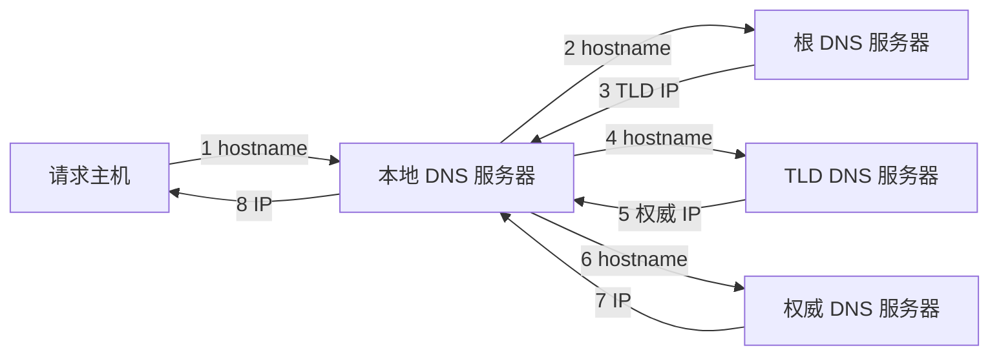
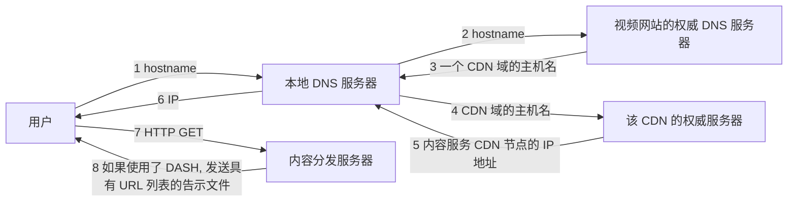

<!--more-->

## 2.1 应用层协议原理

研发网络应用程序的核心是写出能够**在不同的端系统和通过网络彼此通信的程序**。但不需要写在网络核心设备如路由器或链路层交换机上运行的软件，因为网络核心设备并不在应用层上起作用，而仅在较低层起作用（网络层及下面），即将应用程序限制在**端系统**。

### 体系结构

从应用程序研发者的角度看，网络体系结构是固定的，并为应用程序提供了特定的服务集合。另一方面，应用程序体系结构由应用程序研发者设计，规定了如何在各种端系统上组织该应用程序。

① **客户-服务器体系结构**

- 有一个始终保持开启的主机称为**服务器**，它服务于来自许多其他称为客户的主机的请求。
- **客户相互之间不直接通信**。
- 服务器具有**固定、周知**的 **IP 地址**，并始终保持打开。
- 当请求过多时，可能需要配置**数据中心**作为虚拟服务器。

> 实例如：Web、FTP、Telnet 和电子邮件

② **P2P 体系结构**

- 对位于数据中心的专用服务器有**最小的依赖**。
- 应用程序在间断连接的主机对之间使用**直接通信**，这些主机被称为**对等方**。
- **自拓展性**：在一个 P2P 文件共享应用中，尽管每个对等方都由于请求文件产生工作负载，但每个对等方通过向其他对等方分发文件也为系统增加服务能力。并且 P2P 体系结构通常不需要庞大的服务器基础设施和服务器带宽。

> 实例（流量密集型应用）如：BitTorrent、Skype、因特网电话、迅雷

### 进程通信

**进程**：一个进程可以被认为是运行在端系统中的一个程序。

- 当多个进程运行在**相同**的端系统上时，它们使用**进程间通信机制**相互通信。进程间通信的规则由端系统上的**操作系统**确定。
- 而在两个**不同**的端系统上的进程，通过跨越计算机网络**交换报文**而相互通信。

**客户和服务器进程**：

在一对进程之间的通信会话场景中，**发起通信**（即在该会话开始时发起与其他进程的联系）的进程被标识为**客户**，在会话开始时**等待联系**的进程是**服务器**。

**进程与计算机网络之间的接口**：

- 进程通过**套接字**的软件接口向网络发送报文和从网络接收报文。

- 套接字是同一台主机内**应用层**与**运输层（协议）**之间的接口，也被称为应用程序和网络之间的**应用程序编程接口（API）**。

- 应用程序开发者可以控制套接字在应用层端的一切，但是对该套接字的运输层几乎没有控制权。

  对运输层的控制仅限于：① 选择传输层协议；② 也许能设定几个运输层参数，如最大缓存和最大报文段长度等。

**进程寻址**：

向接收进程发送分组需要标明接收进程的**地址**，包含两种信息：① **主机的地址（IP 地址）**；② 在目的主机中指定接收进程的标识符 **（目的地端口号）**

> 常用端口号：
>
> - Web 服务器 - 80
> - 邮件服务器进程（SMTP）- 25

### 运输服务

在发送端的应用程序将报文**推进**套接字，而在该套接字的另一侧，运输层协议负责从发送进程的套接字得到该报文。

对应用程序服务要求分类：**可靠数据传输、吞吐量、定时和安全性**。


**TCP 服务**：

- **面向连接服务**：在应用层数据报文开始流动之前，TCP 让客户和服务器互相交换**运输层控制信息**，**三次握手**后一个 **TCP 连接**就在两个进程之间的**套接字**之间建立了，这条连接是**双工**的。当应用程序结束报文发送时，必须拆除该连接。
- **可靠数据传输服务**：通信进程能够依靠 TCP，无差错、按适当顺序交付所有发送的数据。
- **拥塞控制机制**

> TCP 安全：SSL
>
> **安全套接字层（SSL）**可以加强 TCP，提供进程到进程的安全性服务。但 SSL **不是**与 TCP 和 UDP 在相同层次（运输层）上的第三种因特网运输协议，而是一种**对 TCP 的加强**，这种强化是在**应用层上实现的**。
>
> $host\rightarrow SSL\rightarrow TCP\rightarrow\dots\rightarrow TCP\rightarrow SSL\rightarrow host$

**UDP 服务**：

- UDP 是一种**不提供不必要服务**的轻量级运输协议，它仅提供最小服务。
- UDP 是**无连接的**，因此在两个进程通信前没有握手过程。
- UDP 协议提供一种**不可靠数据传送服务**，即 UDP 协议并**不**保证报文能够到达，或者按需到达。
- UDP 没有拥塞控制机制，发送方可以以**任何速率**向互联网注入数据。

**TCP 和 UDP 的使用场景**：

- TCP：电子邮件、终端访问、Web、文件传输（需要可靠数据传输服务）
- UDP：因特网电话（可以容忍丢失但要求达到一定的最小速率）

### 应用层协议

应用层协议定义了运行在不同端系统上的应用程序进程如何相互传递报文。

常用应用层协议：HTTP（用于 Web）、SMTP（简单邮件传输协议）、DNS（为因特网提供目录服务）

## 2.2 Web 和 HTTP

### HTTP

- Web 应用层协议是**超文本传输协议（HTTP）**，HTTP 由两个程序实现：一个客户程序（Web 浏览器）和一个服务器程序（Web 服务器）。

- 客户程序和服务器程序运行在不同的端系统中，通过交换 **HTTP 报文**进行会话。

- HTTP 定义了这些报文的**结构**以及客户和服务器进行报文交换的**方式**。

- HTTP 使用 **TCP** 作为它的支撑运输协议。

- HTTP 是一种**无状态协议**：服务器向客户发送被请求的文件，而**不存储**任何关于该客户的状态信息。

- HTTP 默认使用**持续连接**。

  > **往返时间（RTT）**：指一个短分组从客户到服务器然后再返回客户所花费的时间，包括分组传播时延、分组在中间路由器和交换机上的排队时延以及分组处理时延。

  - 非持续连接：每个请求/响应经一个**单独的** TCP 连接发送，响应时间为**两个 RTT**（三次握手+一次文件响应）加上服务器传输 HTML 文件的时间。
  - 持续连接：每个请求/响应经**相同的** TCP 连接发送，HTTP 默认采用**带流水线**的持续连接。

**报文格式**：

① 请求报文

```http
GET /somedir/page.html HTTP/1.1 —— 请求行（方法字段、URL 字段、HTTP 版本字段
Host: www.someschool.edu —— 首部行（对象所在主机）
Connection: close —— 不使用持续连接
User-agent: Mozilla/5.0
Accept-language: fr
```

② 响应报文

```http
HTTP/1.1 200 OK —— 初始状态行
Connection: close —— 六个首部行
Date: Tue, 18 Aug 2015 15:44:04 GET —— 不是指对象创建或者最后修改的时间，而是服务器从它的文件系统中检索到该对象，将该对象插入响应报文，并发送该响应报文的时间
Server: Apache/2.2.3 (CentOS)
Last-Modified: Tue, 18 Aug 2015 15:11:03 GMT
Content-Length: 6821
Content-Type: text/html
(data data data ...) —— 实体体
```

**cookie**：

四个组件：

1. HTTP 响应报文中的一个 cookie 首部行 (`Set-cookie`)
2. 在 HTTP 请求报文中的一个 cookie 首部行 (`Cookie`)
3. 在用户端系统中保留由有一个 cookie 文件，并由浏览器进行管理
4. 位于 Web 站点的一个后端数据库，存有 `{cookie: value}`

**Web 缓存**：

- Web 缓存器也叫**代理服务器**，有自己的磁盘存储空间，并在存储空间中保存**最近请求过的对象的副本**（如果没有，则向初始服务器请求，向用户响应并保存副本）。

- Web 缓存器既是服务器又是客户，当它接受浏览器的请求并发回响应时，它是一个服务器；当它向初始服务器发出请求并接收响应时，它是一个客户。

- 通过 Web 缓存，可以有效地减少**传播时延**。

  > 一台机构路由器与因特网的另一台路由器通过一条 15Mbps 的链路连接，局域网传输速率为 100Mbps，假设对象的平均长度为 1Mb，平均访问速率为每秒 15 个请求，假设从因特网接入链路一侧的路由器转发 HTTP 请求报文开始，到它收到其响应报文为止的时间平均为 2 秒（因特网时延）。
  >
  > 接入链路的流量强度为：(15 个请求/s) × (1Mb/请求) / (15Mbps) = 1
  >
  > 局域网的流量强度为：(15 个请求/s) × (1Mb/请求) / (100Mbps) = 0.15
  >
  > 局域网上强度为 0.15 的通信量通常导致数十毫秒的时延，可以忽略，但接入链路的流量强度为 1，会导致趋近于无限大的排队时延。
  >
  > 改进1：将接入链路的速率由 15Mbps 提升到 100Mbps，则接入链路的流量强度为 0.15，所导致的链路时延也可以忽略，所以只剩下 2 秒的响应时间。
  >
  > 改进2：安装一个 Web 缓存器，通常的命中率在 0.2 ~ 0.7，假设命中率为 0.4，即 40% 的请求会立即由缓存器得到相应，时延约为 10ms，则平均时延为：0.4 × (0.01s) + 0.6 × (2.01s)，略大于 1.2 秒，比方案 1 的 2 秒时延提升得多。

## 2.3 电子邮件

- 三个组成部分：**用户代理、邮件服务器和简单邮件传输协议（SMTP）**。
- 每个接收方在邮件服务器上有一个**邮箱**，管理和维护发送到他的报文。


- 如果发送方的邮件服务器不能将邮件交付给接收方的邮件服务器，那么会在发送方的**报文队列**中保持该报文并在以后尝试再次发送，如果一直不能成功，邮件服务器就会删除该报文并以电子邮件的形式通知发送方。
- SMTP 使用 **TCP** 可靠数据传输服务，并且是**持续连接**。
- SMTP 存在两个部分：运行在发送方邮件服务器的客户端和运行在接收方邮件服务器的服务器端。每台邮件服务器上既运行 SMTP 客户端也运行 SMTP 服务器端。
- SMTP 一般**不使用中间邮件服务器**发送邮件。
- TCP 连接建立后，还需要进行 **SMTP 握手**，常用命令：`HELO, MAIL, FROM, RCPT TO, DATA, QUIT`

**与 HTTP 的对比**：

- 都使用 **TCP 持续连接**。
- HTTP 是**拉协议**，从服务器拉取信息。
- SMTP 是**推协议**，发送邮件服务器把文件推向接收邮件服务器，但 TCP 连接是由发送方发起的。

**邮件报文格式**：

首部：

```http
From: alice@crepes.fr
To: bob@hamburger.edu
Subject: Searching for the meaning of life.
```

### 邮件访问协议

- 标准方式：用户登录到服务器主机，并直接在该主机上运行一个邮件阅读程序来阅读邮件。但每个邮件服务器既是客户端，也是服务器，所以为了收件，用户需要**保持主机开启**，这是传统模式的一个缺陷。

- 用户的用户代理用 SMTP 将电子邮件推入他的邮件服务器，邮件服务器之间的传输也是通过 SMTP，但是接收方的用户代理不能使用 SMTP 得到报文，因为取报文是一个**拉**操作，而 SMTP 协议是**推**协议，因此，可能通过其他协议来完成（POP3、IMAP、HTTP）。

  ```mermaid
  graph LR
  A[Alice 的代理]--SMTP-->B[Alice 的邮件服务器]--SMTP-->C[Bob 的邮件服务器]--POP3/IMAP/HTTP-->D[Bob 的代理]
  ```

#### POP3

三个阶段：

- 特许：用户代理发送（以明文形式）用户名和口令以鉴别用户。
- 事务处理：用户代理取回报文，同时对报文做删除标记或取消报文删除标记，以及统计邮件的统计信息。
- 更新：出现在用户发出了 quit 命令，目的是结束该 POP3 会话，这时该邮件服务器删除那些被标记为删除的报文。

在用户代理与邮件服务器之间的 POP3 会话期间，该 POP3 服务器保留了一些状态信息；特别是记录了哪些用户报文被标记为删除了。然而，**POP3 服务器并不在 POP3 会话过程中携带状态信息**。

使用 POP3 访问时，邮件下载到本地主机后就不能在其他主机上查看，同时 POP3 也不能提供创建远程文件夹并为报文指派文件的方法。

#### IMAP

- IMAP 服务器把每个报文与一个文件夹联系起来；当报文第一次到达服务器时，它与收件人的 INBOX 文件夹相关联，收件人可以对邮件执行一系列操作（移动、阅读、删除等）。
- IMAP 还为用户提供了在远程文件夹中查询邮件的命令。
- **IMAP 服务器维护了 IMAP 会话的用户状态信息**，例如文件夹的名字以及哪些报文与哪些文件夹关联。

#### 基于 Web 的电子邮件

- 用户代理就是普通的浏览器
- 用户和他的远程邮箱之间通过 HTTP 通信（发送和接收邮件）
- 只有远程邮箱（邮件服务器）之间的通信使用 SMTP 协议


## 2.4 DNS：因特网的目录服务

- DNS（域名系统）提供主机名到 IP 地址转换的目录服务，$hostname \stackrel{DNS}{\rightarrow} IP$
- DNS 是：① 一个由分层的 DNS 服务器实现的分布式数据库；② 一个使得主机能够查询分布式数据库的**应用层**协议
- DNS 运行在 UDP 之上，使用 **53** 端口
- DNS 通常是由其他协议所使用的，如 HTTP、SMTP 和 FTP

### 执行过程

- 同一台用户主机上运行着 DNS 应用的客户端
- 浏览器从 URL 中抽取主机名，传给 DNS 应用的客户端
- DNS 客户向 DNS 服务器发送一个包含主机名的请求
- DNS 客户收到响应报文，其中包含对于主机名的 IP 地址
- 浏览器收到来自 DNS 的该 IP 地址，向位于该 IP 地址的 80 端口的 HTTP 服务器进程发起一个 TCP 连接

### 其他服务

- 主机别名到规范主机名的映射
- 邮件服务器名到规范主机名的映射
- **负载分配**：一个 IP 地址集合可能与同一个规范的主机名（多台服务器）相联系，DNS 数据库中存储着这些 IP 地址**集合**。当用户对映射到某地址集合的名字发出一个 DNS 请求时，该服务器用 IP 地址的整个集合进行响应，但**在每个回答中循环这些地址次序**。因为客户端总是向 IP 地址排在最前面的服务器发送 HTTP 请求报文，所以 DNS 就在所有这些冗余的 Web 服务器之间循环分配了负载。也可以用于邮件服务器。

### 工作机理

DNS 服务器的层次结构：根 DNS 服务器、顶级域（TLD）DNS 服务器和权威 DNS 服务器。

查询方式：递归查询和迭代查询

下图中，请求主机到本地 DNS 服务器是递归查询，其余是迭代查询



当有 **DNS 缓存**时，本地 DNS 服务器可能会缓存 TLD 或 权威服务器的 IP 地址，即可以绕过一些上层的 DNS 服务器，提高响应速率。

### DNS 记录和报文

DNS 服务器存储的是**资源记录（RR）**，是一个四元组：`(Name, Value, Type, TTL)`

- Type = A，则 Name 是主机名，Value 是该主机名对应的 IP 地址，如 `(relay1.bar.foo.com, 145.37.93.126, A)`
- Type = NS，则 Name 是个域，而 Value 是个知道如何获取该域中主机 IP 地址的**权威 DNS 服务器**的**主机名**，如 `(foo.com, dns.foo.com, NS)`
- Type = CNAME，则 Value 是别名为 Name 的主机对应的规范主机名，如 `(foo.com, relay1.bar.foo.com, CNAME)`
- Type = MX，则 Value 是别名为 Name 的邮件服务器的规范主机名，如 `(foo.com, mail.bar.foo.com, MX)`

如果一台 DNS 服务器是用于某特定主机名的权威 DNS 服务器，则该 DNS 服务器会有一条包含用于该主机名的类型 A 记录（即使该 DNS 服务器不是其权威 DNS 服务器，它也可能在缓存中包含有一条类型 A 记录）。

如果一台 DNS 服务器不是用于某主机名的权威服务器，那么该服务器包含一条类型 NS 记录，并且包括一条 A 记录，该记录提供了在 NS 记录的 Value 字段中的 DNS 服务器的 IP 地址。


DNS 报文：前三行是报文首部，共 12 字节，查询报文和回答报文格式相同


## 2.5 P2P 文件分发

P2P 体系结构对基础设施服务器有最小的依赖，成对间歇连接的主机（对等方）彼此直接通信。

### P2P 体系结构的扩展性

服务器和对等方使用接入链路与因特网相连。其中 $u_s$ 表示服务器接入链路的**上载速率**，$u_i$ 表示第 $i$ 个对等方接入链路的**上载速率**，$d_i$ 表示第 $i$ 个对等方接入链路的**下载速率**。$F$ 表示被分发的文件长度（比特），$N$ 表示要获得的该文件副本的对等方的数量。**分发时间**是所有 $N$ 个对等方得到该文件副本所需要的时间。假设因特网核心具有足够的带宽，即所有瓶颈都在网络的接入链路，并假设服务器和用户没有参与任何其他网络应用，因此它们的所有上传和下载访问带宽能全部被用于分发给文件。

**① 客户-服务器体系结构：**

设分发时间为 $D_{cs}$

- 服务器必须向 $N$ 个对等方传输该文件的副本，所以 $D_{cs} \geq NF/u_s$
- 令 $d_{min}$ 表示具有最小下载速率的对等方的下载速率，所以 $D_{cs} \ge F/d_{min}$

即：

$$D_{cs} \ge max\{\frac{NF}{u_s}, \frac{F}{d_{min}}\}$$

对足够大的 $N$，客户-服务器体系结构的分发时间由 $NF/u_s$ 决定（**关于 $N$ 的线性关系**）

**② P2P 体系结构：**

设分发时间为 $D_{P2P}$

- 在分发的开始，只有服务器具有该文件。但服务器只需要向接入链路发送该文件**一次**，之后可以在对等方之间互相发送，所以 $D_{P2P}\ge F/u_s$
- 与客户-服务器体系相同，因为对等方的最低下载速率的限制，$D_{P2P}\ge F/d_{min}$
- **从整体而言**，总的上载速率为 $u_{total}=u_s+\sum_{1}^{N}u_i$，而整个系统内部分发了 $N$ 份该文件，总共交付 $NF$ 比特，不能快于 $u_{total}$ 的速率完成，所以 $D_{P2P} \ge NF/u_{total}$

即：

$$D_{P2P}\ge max\{\frac{F}{u_s}, \frac{F}{d_{min}}, \frac{NF}{u_s+\sum_{1}^{N}u_i}\}$$

实际上，P2P 结构体系的分发时间增长趋势相对于客户-服务器体系接近**线性**的增长趋势而言，大多数情况下是更优秀的。

同时，其**扩展性**的成因在于：**对等方除了是比特的消费者外还是它们的重新分发者**。

### BitTorrent

- 参与一个特定文件分发的所有对等方的**集合**称为一个**洪流**，在一个洪流中的对等方彼此下载等长度的**文件块**。一个对等方获得了整个文件，它也许离开洪流（自私），也许继续上载块（无私）。同时，任何对等方可能在仅具有块的**子集**时就离开洪流，并可能在以后重新加入。
- 每个洪流具有一个基础设施节点，称为**追踪器**。当一个对等方加入某洪流时，它向追踪器注册自己，并周期性地通知追踪器它仍在洪流中。
- 当一个新对等方加入洪流时，追踪器**随机**将洪流的**子集**中的数个对等方的 **IP 地址**发给它，使他们创建并行的 **TCP** 连接。

**如何请求块？**

- 对等方 A 周期性地通过 TCP 询问邻居所具有的块，**针对她没有的、并且在邻居中最稀缺的块**，她会首先发起请求
- **最稀缺优先**使得最稀缺的块得到更为迅速的重新分发，目标是**均衡每个块在洪流中的副本数量**。

**给谁发送块？**

- 对等方 A 根据当前能够以**最高速率向她提供数据**的邻居（一报还一报），给其优先权，这些邻居称为**疏通**。
- 每隔一定时间，A 也要**随机**地选择另外一个邻居向其发送块。
- 这种效果是对等方能够以趋向于找到彼此协调的速率上载。随机选择邻居也允许**新的对等方得到块**。

## 2.6 视频流和内容分发网

到目前为止，对流式视频的最为重要的性能度量是平均端到端吞吐量。为了提供连续不断的布局，网络必须为流式应用提供至少与压缩视频比特率一样大的平均吞吐量。

### HTTP 流和 DASH

在 HTTP 流中，视频只是存储在 HTTP 服务器中作为一个普通的文件，每个文件有一个特定的 URL。当用户要看该视频时，客户与服务器创建一个 TCP 连接并发送对该 URL 的 HTTP GET 请求。服务器则以底层网络协议和流量条件允许的尽可能快的速率，在一个 HTTP 响应报文中发送该视频文件。在客户一侧，字节被收集在客户应用**缓存**中。一旦该缓存中的字节数量超过预先设定的阈值，客户应用程序就开始播放。特别是，流式视频应用程序**周期性地**从客户应用程序**缓存**中抓取帧，对这些帧解压缩并且在用户屏幕上展现。因此，流式视频应用接收到视频就进行播放，**同时缓存该视频后面部分的帧**。

客户的带宽有时大有时小，但他们接收到的视频的编码都是相同的（质量相同）。所以出现了**经 HTTP 的动态适应性流（DASH）**。在 DASH 中，视频被编码为几个不同的版本，其中每个版本具有不同的比特率，对应于不同的质量水平。**客户动态地请求来自不同版本且长度为几秒的视频段数据块**。当可用带宽较高时，客户自然地选择来自高速率版本的块，反之选择低速率版本的块。客户用 HTTP GET 请求报文一次选择一个不同的块。

使用 DASH 后，每个视频版本存储在 HTTP 服务器中，每个版本都有一个 URL。HTTP 服务器也有一个**告示文件**，为每个版本提供了一个 URL 及其比特率。客户首先请求该告示文件并且得知各种各样的版本，然后客户通过在 HTTP GET 请求报文中对每块指定一个 URL 和一个字节范围，一次选择一块。**在下载块的同时，客户也测量接收带宽并且运行一个*速率决定算法*来选择下次请求的块**。

### 内容分发网

建立单一数据中心提供流式视频服务的缺陷：

- 客户远离数据中心，则由于经过许多 ISP，可能导致端到端吞吐量减少（由瓶颈链路决定），**时延增大**。
- 流行的视频会经过相同的通信链路发送许多次，**浪费带宽**。
- 可能会出现**单点故障**。

**内容分发网（CDN）**管理分布在多个地理位置上的服务器，在它的服务器中存储视频的副本，并且试图将每个用户请求定向到一个将**提供最好的用户体验**的 CDN 位置。

**专用 CDN**：由内容提供商自己所拥有。

**第三方 CDN**：代表多个内容提供商分发内容。

**CDN 中服务器的安置原则**：

- **深入**：通过在遍及全球的接入 ISP 中部署服务器集群来深入到 ISP 的接入网中。（接近端用户）
- **邀请做客**：通过在少量关键位置建造**大**集群来邀请到 ISP 做客。（让端用户接近）

#### CDN 操作

- 当用户主机中的一个浏览器指令检索一个特定的视频（由 URL 标识）时，CDN 必须**截获**该请求，以便能够：① 确定此时适合用于该客户的 CDN 服务器集群；② 将客户的请求**重定向**到该集群的某台服务器。
- 大多数 CDN 利用 **DNS** 来截获和重定向请求。



#### 集群选择策略

任何 CDN 部署，其核心是**集群选择策略**，即**动态地将客户定向到 CDN 中的某个服务器集群或数据中心的机制**。

- **地理上最邻近策略**

  缺陷：某些端用户配置使用位于远地的本地 DNS 服务器，在这种情况下，选择的 CDN 可能离用户很远。这种简单的策略忽略了时延和可用带宽随因特网路径时间而变化，总是为特定的客户指派相同的集群。

- **基于当前流量条件**：CDN 能够对其集群和客户之间的时延和丢包性能执行周期性的实时测量，例如向全世界所有的 LDNS 发送探测分组（ping 报文或 DNS 请求）。

  缺陷：许多 LDNS 被配置为不会响应这些探测。

#### 案例

**Netflix**：使用自己专用的 CDN，**不使用拉高速缓存**（高速缓存未命中时动态地被推入），而是在非高峰时段通过**推**将这些视频分发给它的 CDN 服务器。并且，Netflix 软件直接**告知**客户使用一台特定的 CDN 服务器（**不使用 DNS 重定向**，未命中时换一个机架）。

**Youtube**：使用**拉高速缓存和 DNS 重定向**。在大部分时间，谷歌的集群选择策略将客户定向到某个集群，使得客户与集群之间的 RTT 是最低的。同时，为了平衡流经集群的负载，有时客户被定向到一个更远的集群。Youtube **没有**适应性流（例如 DASH），而要求**人工选择一个版本**。

**看看**：使用 P2P 交付，不同于 BitTorrent 下载，**请求被优先地给予那些即将播放的块**，以确保连续播放。看看也正向**混合 CDN-P2P 流式系统**迁移，当 P2P 总流量满足视频播放时，该客户将从 CDN 停止流并仅从对等方获得流；如果 P2P 流的流量不充分，则该用户重新启动 CDN 连接并且返回到混合 CDN-P2P 流模式。

## 2.7 套接字编程

目的地址由目的主机的 IP 地址和目的地套接字的端口号组成，发送方的源地址附在分组之上一般由底层操作系统自动实现。

### UDP

客户端：

```python
from socket import *

serverName = 'hostname'
serverPort = 12000

clientSocket = socket(AF_INET, SOCK_DGRAM) # 发送方套接字
message = raw_input('Input lowercase sentence:')
clientSocket.sendto(message.encode(), (serverName, serverPort))

modifiedMessage, serverAddress = clientSocket.recvfrom(2048) # 缓存长度 2048
print(modifiedMessage.decode())
clientSocket.close()
```

服务器：

```python
from socket import *

serverPort = 12000
serverSocket = socket(AF_INET, SOCK_DGRAM)
serverSocket.bind(('', serverPort))
print("The server is ready to receive")

while True:
    message, clientAddress = serverSocket.recvfrom(2048)
    modifiedMessage = message.decode().upper()
    serverSocket.sendto(modifiedMessage.encode(), clientAddress)
```

### TCP

与 UDP 不同，客户和服务器能够开始互相发送数据之前，它们先要握手和创建一个 TCP 连接。TCP 连接的一端与客户套接字相联系，另一端与服务器套接字相联系。当一侧要向另一侧发送数据时，它只需经过其套接字将数据丢进 TCP 连接，这与 UDP 不同，UDP 服务器在将分组丢进套接字前必须为其附上一个目的地地址。

服务器程序必须具有一个**特殊的套接字（欢迎套接字）**，欢迎来自运行在任意主机上的客户进程的某种**初始接触**。当三次握手期间，服务器收到客户进程的请求时，它将生成一个**新的套接字（连接套接字）**，**它专门用于特定的客户**。

客户端：

```python
from socket import *

serverName = 'servername'
serverPort = 12000

clientSocket = socket(AF_INET, SOCK_STREAM)
clientSocket.connect((serverName, serverPort)) # 先绑定 TCP 连接
sentence = raw_input('Input lowercase sentence:')
clientSocket.send(sentence.encode()) # 然后 发送，不用指定地址，因为是发送给 TCP 连接，由 TCP 来发给服务器
# 而 UDP 是 sendto 需要指定地址

modifiedSentence = clientSocket.recv(1024)
print('From Server: ', modifiedSentence.decode())
clientSocket.close()
```

服务器：

```python
from socket import *

serverPort = 12000
serverSocket = socket(AF_INET, SOCK_STREAM)
serverSocket.bind(('', serverPort)) # serverSocket 欢迎套接字
serverSocket.listen(1)
print('The +server is ready to receive')

while True:
    connectionSocket, addr = serverSocket.accept() # connectionSocket 连接套接字
    
    sentence = connectionSocket.recv(1024).decode()
    capitalizedSentence = sentence.upper()
    connectionSocket.send(capitalizedSentence.encode()) # 不用指定地址，因为是发给 TCP 连接的
    
    connectionSocket.close()
```

## 英文术语

中文|英文|英文缩写
:-:|:-:|:-:
应用程序体系结构|application architecture|
自拓展性|self-scalability|
进程|process|
套接字|socket|
应用程序编程接口|Appliaction Programming Interface|API
可靠数据传输服务|reliable data transfer|
带宽敏感应用|bandwidth-sensitive application|
弹性应用|elastic application|
安全套接字层|Secure Sockets Layer|SSL
超文本传输协议|HyperText Transfer Protocol|HTTP
无状态协议|stateless protocol|
非持续连接|non-persistent connection|
往返时间|Round-Trip Time|RTT
Web 缓存器|Web cache|
代理服务器|proxy server|
内容分发网络|Content Distribution Network|CDN
用户代理|user agent|
简单邮件传输协议|Simple Mail Transfer Protocol|SMTP
第三版的邮局协议|Post Office Protocol—Version3|POP3
因特网邮件访问协议|Internet Mail Access Protocol|IMAP
特许|authorization|
域名系统|Domain Name System|DNS
主机别名|host aliasing|
规范主机名|canonical hostname|
邮件服务器别名|mail server aliasing|
负载分配|load distribution|
单点故障|a single point of failure|
通信容量|traffic volume|
远距离的集中式数据库|distant centralized database|
维护|maintenance|
顶级域|Top-Level Domain|TLD
递归|recursive|
迭代|iterative|
资源记录|Resource Record|RR
注册登录机构|registrar|
因特网名字和地址分配机构|Internet Corporation for Assigned Names and Numbers|ICANN
分布式拒绝服务攻击|Distributed Denial-of-Service|DDoS
洪流|torrent|
块|chunk|
追踪器|tracker|
最稀缺优先|rarest first|
疏通|unchoked|
经 HTTP 的动态适应流|Dynamic Adaptive Streaming over HTTP|DASH
告示文件|manifest file|
集群选择策略|clustser selection strategy|
实时测量|real-time measurement|