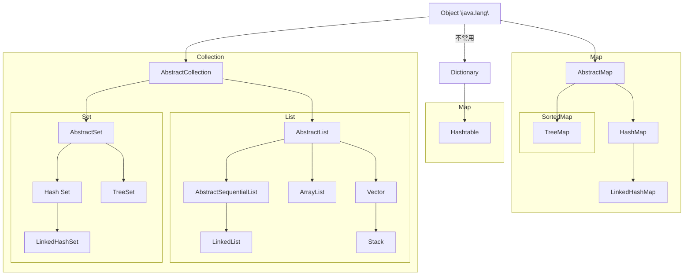

## 数组

### 概念

数组是一个存放多个数据的容器

- 数据是**同一种类型**
- 所有的数据是**线性**规则排列
- 可通过**位置索引**来快速定位访问数据
- 需明确容器的**长度**（静态）

### Java 数组定义和初始化

- `int a[]; // a 还没有 new 操作，实际上是 null，也不知道内存位置`
- ✔`int[] b; // b 还没有 new 操作，实际上是 null，也不知道内存位置` （**更常用**）
- ✔`int[] c = new int[2]; // c 有 2 个元素，都是 0`
- `int d[] = new int[]{0, 2, 4}; // d 有 3 个元素，0、2、4，同时定义和初始化`
- `int d1[] = {1, 3, 5}; // d1 有 3 个元素，1、3、5，同时定义和初始化`

**错误示例：（声明变量时没有分配内存，不能指定大小）**

- `int e[5];`
- `int[5] f;`
- `int[5] g = new int[5];`
- `int h[5] = new int[5];`

### 数组索引 

- 数组的 `length` **属性**标识数组的长度
- 从 `0` 开始，到 `length - 1` 
- `int[] a = new int[5]; // a[0] ~ a[4], not a[5]; a.length 是 5`
- 数组不能越界访问，否则会报 `ArrayIndexOutOfBoundsException` 异常

### 数组遍历：两种方法

```java
// 需要自己控制索引位置（注意 length 是属性而不是方法）
for (int i = 0; i < d.length; i++) {
    System.out.println(d[i]);
}

// 无需控制索引位置（Java 5.0 及以上）
for (int e: d) {
    System.out.println(e);
}
```

### 多维数组

- 存储是按照**行存储**原则

```java
// 规则数组
int a[][] = new int[2][3];

// 不规则数组
int b[][];
b = new int[3][];
b[0] = new int[3];
b[1] = new int[4];
b[2] = new int[5];

int k = 0;
for (int i = 0; i < b.length; i++) {
    for (int j = 0; j < b[i].length; j++) {
        b[i][j] = ++k;
    }
}

for (int[] items: b) {
    for (int item: items) {
        System.out.print(item + ", ");
    }
    System.out.println();
}

输出：
	1, 2, 3, 
	4, 5, 6, 7, 
	8, 9, 10, 11, 12, 
```

## `JCF`（容器框架）

### 概念

- 容器：能够存放数据的空间结构
  - 数组/多维数组，只能**线性**存放
  - 列表/散列集/树/…… 
- 容器框架：为表示和操作容器而规定的一种标准体系结构
  - 对外的接口：容器中所能存放的抽象数据类型
  - 接口的实现：可复用的数据结构
  - 算法: 对数据的查找和排序
- 容器框架优点：提高数据存取效率，避免程序员重复劳动
- `C++` 的 `STL`，`Java` 的 `JCF`

### 发展历史

- `Java 1.1` 和以前的数据结构
  - `Vector, Stack, Hashtable, Enumeration` 等
- `Java 1.2` 和以后，**`JCF` 集合框架**
  - 功能更强大
  - 易于学习
  - 接口和实现分离，多种设计模式设计更灵活
  - 泛型设计

:::tip
JCF：Java Collection Framework
:::

### `JCF` 数据结构概览



> 我们主要关注图中的 `List, Set, Map`
>
> 还有两个工具(算法)类 `Arrays` 和 `Collections`

### JCF 接口

- 早期接口 `Enumeration`
- JCF 的集合接口是 `Collection`
  - `add, contains, remove, size`
  - `iterator`
- JCF 的迭代器接口 `Iterator`
  - `hasNext` 判断是否有下一个元素
  - `next`
  - `remove`

### JCF 中的主要类

- JCF 主要的数据结构实现类
  - 列表(`List, ArrayList, LinkedList`)
  - 集合(`Set, HashSet, TreeSet, LinkedHashSet`)
  - 映射(`Map, HashMap, TreeMap, LinkedHashMap`) 
- JCF 主要的算法类
  - `Arrays`:  对数组进行查找和排序等操作
  - `Collections`：对 `Collection` 及其子类进行排序和查找操作