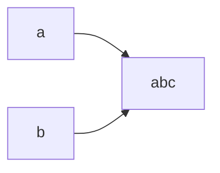
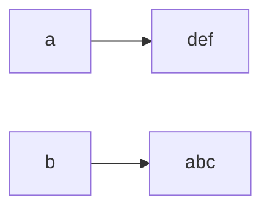
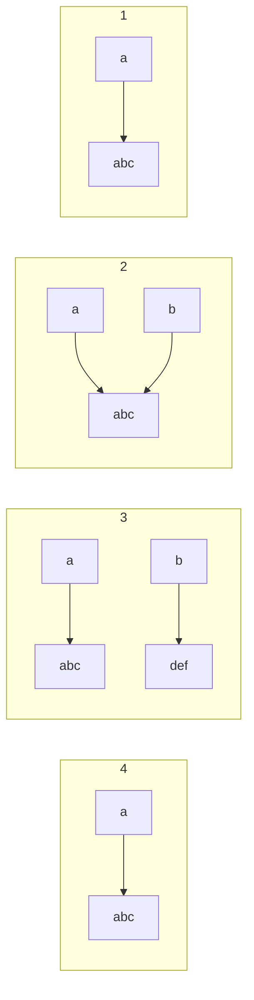

<!--more-->

## 不可变对象

- 不可变对象(`Immutable Object`)
  - 一旦创建，这个对象（状态/值）不能被更改了
  - 其内在的成员变量的值就不能修改了。
  - 典型的不可变对象
    - 八个基本型别的包装类的对象 
    - `String`，`BigInteger` 和 `BigDecimal` 等的对象 

- 可变对象(`Mutable Object`)
  - 普通对象

### `String` 类举例

例一：

```java
String a = new String("abc");
String b = a; // b 和 a 指向同一块内存
System.out.println(b); // "abc"
```



```java
a = "def"; // a 指向改变了
System.out.println(b);
```



例二：

```java
public static void change(String b) {
    b = "def"; // 3
}

public static void main(String[] args) {
    String a = new String("abc");  // 1
    change(a); // 2
    System.out.println(a); // 4 
}

输出：
    abc
```



- 不可变对象，也是传**指针(引用)**

- 由于不可变，**临时变量**指向新内存，**外部实参的指针不改动**

###  如何创建不可变对象 

- `immutable` 对象是不可改变，有改变，请 `clone/new` 一个对象进行修改
- **所有的属性都是 `final` 和 `private` 的**
- **不提供 `setter` 方法**
- **类是 `final` 的，或者所有的方法都是 `final`**
- 类中包含 `mutable` 对象，那么返回拷贝需要深度 `clone`

**优缺点**：

- 不可变对象(`Immutable Object`)优点

  - 只读，线程安全
  - 并发读，提高性能
  - 可以重复使用

- 缺点

  - 制造垃圾，浪费空间

    > 对不可变对象进行修改时，会新开辟空间（如上例中被修改的 `b`），就对象则被搁置，直到垃圾回收

### `Java` 字符串

- 字符串是 `Java` 使用最多的类，是一种典型的不可变对象
- `String` 定义有 2 种
  - `String a = "abc"; // 常量赋值，栈分配内存`
  - `String b = new String("abc");  // new 对象，堆分配内存`
- **字符串内容比较：`equals`方法**
- **是否指向同一个对象：指针比较 `==`**


- Java 常量池(`Constant Pool`)
  - 保存在编译期间就已经确定的数据
  - 是一块特殊的内存
  - 相同的**常量字符串**(`new` 出来的字符串不算)只存储一份，节省内存，共享访问


- 字符串的加法

- `String a = "abc"; // a 指向"abc"`

- `a = a + "def"; // a 重新指向"abcdef"，"abc"的内存被浪费，由于 String 不可修改，效率差`

- 使用 `StringBuffer/StringBuilder` 类的 `append` 方法进行修改

- `StringBuffer/StringBuilder` 的对象都是可变对象（以 `abc` 为基础，扩张为 `abcdef`）

  - `StringBuffer` (**同步，线程安全，修改快速**)

  - `StringBuilder` (**不同步，线程不安全，修改更快**)

#### 比较各不同类型字符串操作的时间性能

```java
import java.util.Calendar;

public class StringAppendTest {
    public static void main(String[] args) {
        int n = 50000;
        Calendar t1 = Calendar.getInstance(); // 获取系统当前时间
        String a = new String();
        for (int i = 0; i < n; i++) {
            a = a + i + ",";
        }
        System.out.println(Calendar.getInstance().getTimeInMillis() - t1.getTimeInMillis()); // 输出毫秒数

        Calendar t2 = Calendar.getInstance();
        StringBuffer b = new StringBuffer("");
        for (int i = 0; i < n; i++) {
            b.append(i);
            b.append(",");
        }
        System.out.println(Calendar.getInstance().getTimeInMillis() - t2.getTimeInMillis());

        Calendar t3 = Calendar.getInstance();
        StringBuilder c = new StringBuilder("");
        for (int i = 0; i < n; i++) {
            c.append(i);
            c.append(",");
        }
        System.out.println(Calendar.getInstance().getTimeInMillis() - t3.getTimeInMillis());
    }
}

输出：
    1454
    7
    5
```

#### 可变对象和不可变对象传参

```java
public class ArgumentPassing {
    public static void changeValue(int a) {
        a = 10;
    }

    public static void changeValue(String s1) {
        s1 = "def";
    }

    public static void changeValue(StringBuffer s1) {
        s1.append("def");
    }

    public static void main(String[] args) {
        int a = 5;
        String b = "abc";
        StringBuffer c = new StringBuffer("abc");
        changeValue(a);  // 参数为基本类别，传值，a 不变
        changeValue(b);  // 参数为不可变对象，传指针，但由于字符串的不可变性，只是在函数内部的 s1 改变了指针，b 不变。如上面的例二。
        changeValue(c);  // 参数为可变对象，传指针，c 原地扩张
        System.out.println(a);
        System.out.println(b);
        System.out.println(c);
    }
}

输出：
    5
    abc
    abcdef
```

## 总结

- 不可变对象提高读效率
- 不可变对象设计的方法
- 字符串 `append` 操作速度：`StringBuilder > StringBuffer > String`