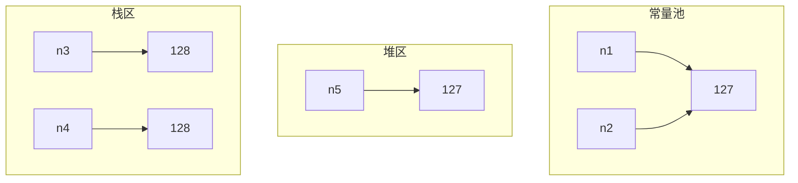
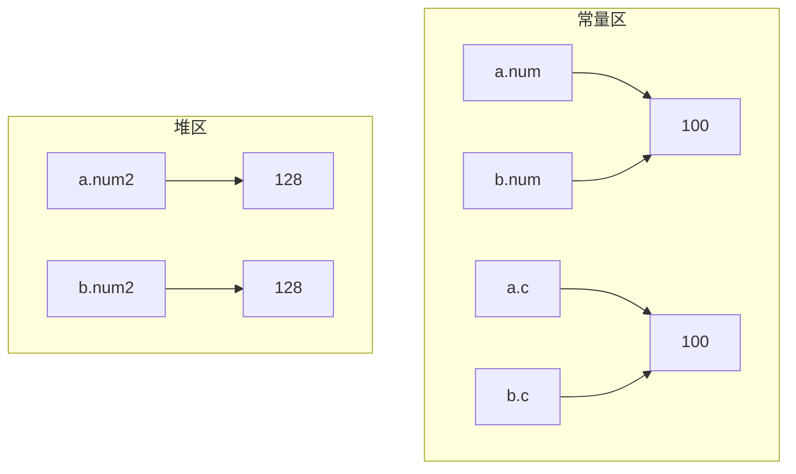
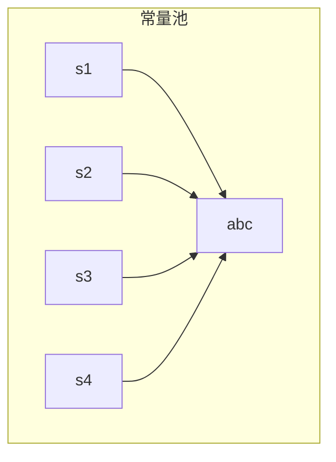
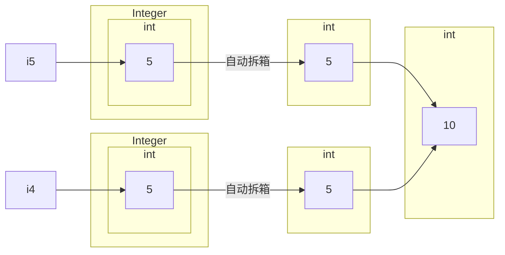
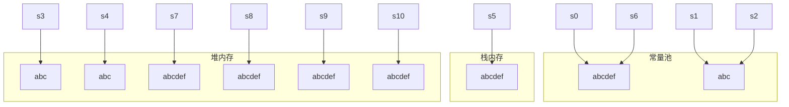

<!--more-->

## 常量设计

**常量**：一种不会修改的变量 

- `Java` 没有 `constant` 关键字 
- 不能修改，**`final`**
- 不会修改/只读/只要一份，**`static`**
- 方便访问，**`public`**

 **Java 中的常量**

- **`public static final`** ( `static` 和 `final` 的位置任意)
- 建议变量名字全大写，以连字符相连，如 `UPPER_BOUND`

```java
public class Constants {
    public static final double PI_NUMBER = 3.14;
    public final static String DEFAULT_COUNTRY = "China";

    public static void main(String[] args) {
        System.out.println(Constants.PI_NUMBER);
        System.out.println(Constants.DEFAULT_COUNTRY);
    }
}

输出：
    3.14
    China
```

一种特殊的常量：**接口**内定义的变量**默认是常量**。但一般不在接口内定义变量。

```java
public interface SpecialAnimal {
    String color = "yellow";  // default: public static final
    public void move();
}

public class Cat implements SpecialAnimal {
    public void move() {
        System.out.println("I can move.");
    }

    public static void main(String[] args) {
        Cat cat = new Cat();
        cat.color = "white"; // error, the variable in interface are constants.
    }
}
```

## 常量池

- `Java` 为很多基本类型的**包装类/字符串都建立常量池**
- 常量池：**相同的值只存储一份，节省内存，共享访问**
- 基本类型的**包装类**：`Boolean，Byte，Short，Integer，Long，Character，Float，Double` (包装类首字母大写)
  - `Boolean： true,  false` 
  - `Character : \u0000--\u007f   (0—127)`
  - `Short, Int, Long, Byte：-128~127`
  - **`Float，Double`：没有缓存(常量池)**

### 基本类型的包装类常量池

例一：

```java
public class IntegerTest {
    public static void main(String[] args) {
        Integer n1 = 127; //0-127 在常量池
        Integer n2 = 127;
        System.out.println(n1 == n2);
        // 对象双等号是比较指针是否指向同一个东西
        Integer n3 = 128;
        Integer n4 = 128; // > 127 不在常量池
        System.out.println(n3 == n4);
        Integer n5 = new Integer(127); // new 的对象在堆区
        System.out.println(n1 == n5);
    }
}

输出：
    true
    false
    false
```

解释：包装类定义的都是对象（引用），在常量池内的对象指针都指向同一块内存。



例二：

```java
public class CacheTest {
    public static void main(String[] args) {
        Boolean b1 = true;
        Boolean b2 = true;
        System.out.println("Boolean Test: " + String.valueOf(b1 == b2));

        Character c1 = 127; // \u0000-\u007f
        Character c2 = 127;
        System.out.println("Character Test: " + String.valueOf(c1 == c2));
        
        Byte b3 = 127;  // -127-128
        Byte b4 = 127;
        System.out.println("Byte Test: " + String.valueOf(b3 == b4));

        Short s1 = -128; // -128-127
        Short s2 = -128;
        System.out.println("Short Test: " + String.valueOf(s1 == s2));

        Integer i1 = -128; // -128-127
        Integer i2 = -128;
        System.out.println("Integer Test: " + String.valueOf(i1 == i2));

        Long l1 = -128L; // -128-127
        Long l2 = -128L;
        System.out.println("Long Test: " + String.valueOf(l1 == l2));

        Float f1 = 0.5f;
        Float f2 = 0.5f;
        System.out.println("Float Test: " + String.valueOf(f1 == f2));

        Double d1 = 0.5;
        Double d2 = 0.5;
        System.out.println("Double Test: " + String.valueOf(d1 == d2));
    }
}

输出：
    Boolean Test: true
    Byte Test: true
    Character Test: true
    Short Test: true
    Integer Test: true
    Long Test: true
    Float Test: false
    Double Test: false
```

例三：

```java
public class A {
    public Integer num = 100;
    public Integer num2 = 128;
    public Character c = 100;
}

public class B {
    public Integer num = 100;
    public Integer num2 = 128;
    public Character c = 100;

    public static void main(String[] args) {
        A a = new A();
        B b = new B();
        System.out.println(a.num == b.num);
        System.out.println(a.num2 == b.num2);
        System.out.println(a.c == b.c);
    }
}

输出：
    true
    false
    true
```



### 字符串常量池

`Java` 为**常量字符串**都建立常量池缓存机制 

```java
public class StringConstantTest {
    public static void main(String[] args) {
        String s1 = "abc";
        String s2 = "abc";
        String s3 = "ab" + "c"; //都是常量，编译器将优化，下同
        String s4 = "a" + "b" + "c"; 
        System.out.println(s1 == s2);
        System.out.println(s1 == s3);
        System.out.println(s1 == s4);
    }
}

输出：
    true
    true
    true
```



基本类型的包装类和字符串有两种创建方式

- 常量式(字面量)赋值创建，放在**栈内存** (**将被常量化**) 
  - `Integer a = 10;`
  - `String b = "abc";`
- `new`对象进行创建，放在**堆内存**(**不会常量化**)
  - `Integer c = new Integer(10);`
  - `String d = new String("abc");`
- 这两种创建方式导致创建的对象存放的位置不同

> 栈区内存访问速度快，但空间较小；
>
> 堆区内存访问速度慢，但空间较大。一般 `new` 的对象，编译器觉得可能比较庞大，都会放到堆区。

### 实例分析

例一：

```java
int i1 = 10;
Integer i2 = 10; // 10 本身是 int 类型，自动装箱为 Integer，并且 i2 在常量池中
System.out.println(i1 == i2); // 基本类型和对象比较 true
// 自动拆箱 基本类型和包装类进行比较，包装类自动拆箱
```

```mermaid
graph LR
	i2-->A
	A--2.自动拆箱-->B
	i1-->B
	i1-.3.相等.-i2
	subgraph Integer
		subgraph C[int]
			A[10]
		end
	end
	subgraph D[int]
		B[10]
	end
	subgraph E[int]
		F[10]--1.自动装箱-->A
	end
```

```java
Integer i3 = new Integer(10);
System.out.println(i1 == i3); // 基本类型和对象比较 true
// 自动拆箱 基本类型和包装类进行比较 包装类自动拆箱
```

```java
Integer i4 = new Integer(5);
Integer i5 = new Integer(5);
System.out.println(i1 == (i4 + i5)); // 基本类型和基本类型比较 true
System.out.println(i2 == (i4 + i5)); // 对象和基本类型比较 true
System.out.println(i3 == (i4 + i5)); // 对象和基本类型比较 true
// i4 + i5 操作将会使得 i4, i5 自动拆箱为 int 基本类型并运算得到 10
// 基础类型 10 和对象比较，将会使对象自动拆箱，做基本类型比较
```

以下为 `i4 + i5` 的分解步骤：



```java
Integer i6 = i4 + i5; // +操作使得 i4, i5 自动拆箱，得到 10，然后 10 自动装箱，并且由于 i6 是常量赋值的对象，因此在常量池中，i6 == i2
System.out.println(i1 == i6); // 基本类型和对象比较 true
System.out.println(i2 == i6); // 对象和对象比较 都在常量池中 true
System.out.println(i3 == i6); // 对象和对象比较 i3 是 new 的，i6 不是 false
```

例二：

```java
public class StringNewTest {
    public static void main(String[] args) {
        String s0 = "abcdef";
        String s1 = "abc";
        String s2 = "abc";
        String s3 = new String("abc");
        String s4 = new String("abc");
        System.out.println(s1 == s2); // true 常量池
        System.out.println(s1 == s3); // false 一个堆内存，一个栈内存
        System.out.println(s3 == s4); // false 两个都是堆内存
        
        String s5 = s1 + "def"; // 涉及到变量 s1，故编译器不优化，不在常量池中
        String s6 = "abc" + "def"; // 都是常量，编译器会自动优化为 abcdef
        String s7 = "abc" + new String("def"); // 涉及到 new 对象，编译器不优化，不在常量池中
        System.out.println(s5 == s6); // false
        System.out.println(s5 == s7); // false
        System.out.println(s6 == s7); // false
        System.out.println(s0 == s6); // true
        
        String s8 = s3 + "def"; // 涉及到 new
        String s9 = s4 + "def"; // 涉及到 new
        String s10 = s3 + new String("def"); // 涉及到 new
        System.out.println(s8 == s9); // false
        System.out.println(s8 == s10); // false
        System.out.println(s9 == s10); // false
    }
}
```



## 总结

- `Java` 中的常量：`static` 和 `final`
- `Java` 接口中的变量都是常量
- 对象生成有两种：常量赋值(栈内存)和 `new` 创建(堆内存)
- `Java` 为 `Boolean, Byte, Character, Short, Int, Long, String` 的常量赋值建立常量池，**没有包括 `Float` 和 `Double`**
- `Java` 编译器会优化**已经确定的变量**