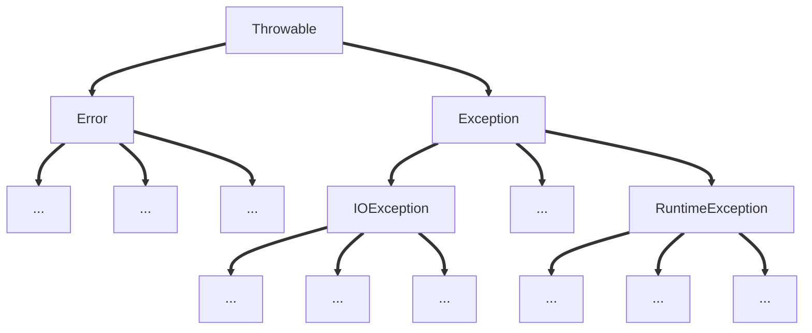

<!--more-->

## Java 异常分类

### 异常概述

**异常：程序不正常的行为或者状态。** 

- `int a = 5 / 0; `
- 数组越界访问
- 读取文件，结果该文件不存在

**异常处理**

- 程序返回到安全状态 
- 允许用户保存结果，并以适当方式关闭程序

### 异常分类



- `Throwable`: 所有错误的祖先
- `Error`: 系统内部错误或者资源耗尽。不管。 
- `Exception`: 程序有关的异常。**重点关注**。 
  - `RuntimeException`: 程序自身的错误
    - 5/0，空指针，数组越界…
  - **非** `RuntimeException`：外界相关的错误
    - 打开一个不存在文件
    - 加载一个不存在的类…

---

- `Unchecked Exception` : (**编译器不会辅助检查**的，需要程序员自己管的)异常，**包括 `Error` 子类和`RuntimeException` 子类。**  
- **`非 RuntimeException` 的 `Exception` 的子类**: (**编译器会辅助检查**的)异常，又叫 `checked exception`。
- **注意**: 编译器会检查程序是否为 `checked exception` 配置了处理。如果没有处理，会报错。

---

- `Checked Exception` ( **`非 RuntimeException` 的 `Exception` 的子类)，程序员必须处理，以发生后处理为主**。编译器会辅助检查。
- `Unchecked Exception` 中的 `RuntimeException` 子类，程序员必须处理，**以预防为主**。编译器不关心此类异常，也不会辅助检查。
- `Error` 的子类，可以不用处理。

---

### 例（`RuntimeException`)

```java
class Person {
    int id;
    String name;
}

public class ExceptionDemo {
    public static void main(String[] args) {
        int n = 5 / 0; // ArithmeticException
        int[] a = new int[3];
        System.out.println(a[3]); // ArrayIndexOutofBoundsException

        Person p1 = new Person();
        System.out.println(p1.id);
        System.out.println(p1.name.length()); // NullPointerException
    }
}

```

## 异常分类总结

- 异常是程序发生不正常的行为或出现不正常的状态
- Java 异常分成 `Exception` (程序相关，必须处理)和 `Error` (系统相关，不用处理)
- Java 程序相关的异常又分成 **`unchecked(RuntimeException 和 Error)` 异常和 `checked(非 RuntimeException)` 异常**，掌握其不同的处理原则
- **编译器会辅助检查 `checked` 异常**

## Java 异常处理

**异常处理** 

- 允许用户及时保存结果
- 抓住异常，分析异常内容
- 控制程序返回到安全状态

---

- **`try-catch-finally`: 一种保护代码正常运行的机制。**
- **异常结构**
  - `try…catch` (`catch` 可以有多个，下同)
  - `try…catch…finally`
  - `try…finally` 

- **`try` 必须有，`catch` 和 `finally` 至少要有其中一个**

- `try`: 正常业务逻辑代码。
- `catch`: 当 `try` 发生异常，将执行 `catch` 代码。若无异常，绕之。
- `finally`: 当 `try` 或 `catch` 执行结束后，必须都要执行 `finally`

---

### 例（`try-catch-finally`）

```java
public class TryDemo {
    public static void main(String[] args) {
        // try-catch-finally 的顺序不能变动
        try {
            int a = 5 / 2;
            System.out.println("a is " + a);
        }
        catch(Exception ex) {
            ex.printStackTrace();
        }
        finally {
            System.out.println("Phrase 1 is over");
        }

        try {
            int a = 5 / 0;
            System.out.println("a is " + a);
        }
        catch (Exception ex) {
            ex.printStackTrace();
        }
        finally {
            System.out.println("Phrase 2 is over");
        }

        try {
            int a = 5 / 0;
            System.out.println("a is " + a);
        }
        catch (Exception ex) {
            ex.printStackTrace();
            int a = 5 / 0; // 尽管这里还是会报错，但是下面的 finally 还是会被执行
        }
        finally {
            System.out.println("Phrase 3 is over");
        }
    }
}

输出：
    a is 2
    Phrase 1 is over
    java.lang.ArithmeticException: / by zero
        at MOOC0902.TryDemo.main(TryDemo.java:17)
    Phrase 2 is over
    java.lang.ArithmeticException: / by zero
        at MOOC0902.TryDemo.main(TryDemo.java:28)
    Phrase 3 is over
    Exception in thread "main" java.lang.ArithmeticException: / by zero
        at MOOC0902.TryDemo.main(TryDemo.java:33)
```

- `catch` 块可以有多个，每个有不同的入口形参。**当已发生的异常和某一个 `catch` 块中的形参类型一致**，那么将执行该 `catch` 块中的代码。**如果没有一个匹配，`catch` 也不会被触发。最后都进入 `finally` 块。**
- **进入 `catch` 块后，并不会返回到 `try` 发生异常的位置，也不会执行后续的 `catch` 块，一个异常只能进入一个`catch` 块**
- `catch` 块的异常匹配是**从上而下**进行匹配的。

- 所以**一般是将小的异常写在前面(如 `ArithmeticException`) ，而一些大（宽泛）的异常(如 `Exception`)则写在末尾**

---

```jAVA
public class MultipleCatchDemo {
    public static void main(String[] args) {
        try {
            int a = 5 / 0;
            System.out.println("a is " + a);
        }
        catch (Exception ex) {
            ex.printStackTrace();
        }
        // 报错，因为下面的 catch 块肯定不会被到达，应该放在 Expection 上面
        catch (ArithmeticException e) {
            e.printStackTrace();
        }
        finally {
            System.out.println("Phrase 1 is over");
        }
    }
}
```

- `try` 结构中，如果有 `finally` 块，`finally` 肯定会被执行。

- `try-catch-finally` 每个模块里面也会发生异常，所以也可以在内部继续写一个完整的 `try` 结构。

  如：

  ```java
  try {
      try-catch-finally
  }
  catch {
      try-catch-finally
  }
  finally {
      try-catch-finally
  }
  ```

  但不允许：

  ```java
  try {
      try {
          
      }
  }
  catch (Excepetion ex1) {
      catch (Exception ex2) {
          
      }
  }
  finally {
      finally {
          
      }
  }
  ```

---

### `throws` 声明异常

- 方法存在可能异常的语句，但不处理，那么可以使用 `throws` 来声明异常。
- 调用带有 `throws` 异常（`checked exception`）的方法，要么处理这些异常，或者再次向外 `throws` ，直到 `main`函数为止。 

#### 例 1：`RuntimeException` 异常的 `throws`

```java
class Test {
    // ArithmeticException is a RuntimeException, not checked exception
    public int divide (int x, int y) throws ArithmeticException {
        int result = x / y;
        return result;
    }
}

public class ThrowsDemo {
    public static void main(String[] args) {
        try {
            int result = new Test().divide(3, 1);
            System.out.println("the 1st result is " + result);
        }
        catch (ArithmeticException ex) {
            ex.printStackTrace();
        }
        // 此处的 RuntimeException 异常并没有被处理，而是一直向外抛出
        int result = new Test().divide(3, 0);
        System.out.println("the 2nd result is " + result);
    }
}

输出：
    the 1st result is 3
	Exception in thread "main" java.lang.ArithmeticException: / by zero
        // 会告诉你哪一个程序依次地调用栈
        at MOOC0902.Test.divide(ThrowsDemo.java:6)
        at MOOC0902.ThrowsDemo.main(ThrowsDemo.java:20)
```
#### <a name="1">例 2： `非 RuntimeException(checked exception)` 异常的 `throws`</a>

```java
// MyException is a checked exception
public class MyException extends Exception {
    private String returnCode; // 异常对应的返回码
    private String returnMsg; // 异常对应的状态信息

    public MyException() {
        super();
    }

    public MyException(String returnMsg) {
        super(returnMsg);
        this.returnMsg = returnMsg;
    }

    public MyException(String returnCode, String returnMsg) {
        super();
        this.returnCode = returnCode;
        this.returnMsg = returnMsg;
    }

    public String getReturnCode() {
        return returnCode;
    }
    
    public String getReturnMsg() {
        return returnMsg;
    }
}

public class MyExceptionTest {
    public static void testException() throws MyException {
        throw new MyException("10001", "The reason of MyException");
    }

    // 如果调用了一个有 checked exception 异常的方法，必须对外抛出（或者用 try-catch-finally 处理），否则编译无法通过
    public static void main(String[] args) throws MyException {
        MyExceptionTest.testException();
    }
}
```

---

### 与继承相关

- 一个方法被覆盖，**覆盖它的方法必须抛出相同的异常，或者异常的子类**。
- 如果父类的方法抛出多个异常，那么重写的子类方法必须抛出那些异常的**子集**，也就是**不能抛出新的异常**。

例：

```java
public class Father {
    public void f1() throws ArithmeticException {

    }
}

public class Son extends Father {
    public void f1() throws Exception {
		// 报错，子类方法所抛出的异常不能超过父类方法的异常范围
    }
}
```

### 异常处理总结

- `try-catch-finally` 处理异常 
- `throws` **声明**异常，`throw` **抛出**异常
- 子类重写的方法所声明的异常不能超出父类方法声明的范围

## 自定义异常

- `Exception` 类是所有异常的父类。
- `Exception` 继承自 `java.lang.Throwable`，同时，它有一个兄弟 `Error`。
- `Error`是更严重的问题，一般是系统层面的，无需程序处理。
- 程序只需要处理 `Exception`

---

- 自定义异常，需要继承 `Exception` 类或其子类。
- **继承自 `Exception`，就变成 `Checked Exception`** 
- **继承自 `RuntimeException`, 就变成 `Unchecked Exception`** 
- 自定义重点在**构造函数**
  - 调用父类 `Exception` 的 `message` 构造函数
  - 可以自定义自己的成员变量
- 在程序中采用 `throw` 主动抛出异常

---

### 例（自定义异常）

例 1：同上一节 `throws` 的 <a href="#1">例 2</a>

```java
// MyException is a checked exception
public class MyException extends Exception {
    private String returnCode; // 异常对应的返回码
    private String returnMsg; // 异常对应的状态信息

    public MyException() {
        super();
    }

    public MyException(String returnMsg) {
        super(returnMsg);
        this.returnMsg = returnMsg;
    }

    public MyException(String returnCode, String returnMsg) {
        super();
        this.returnCode = returnCode;
        this.returnMsg = returnMsg;
    }
	
    // 其实完全不需要下面的两个 get 方法，Exception 类自身就有 getMessage()方法！
    public String getReturnCode() {
        return returnCode;
    }
    
    public String getReturnMsg() {
        return returnMsg;
    }
}

public class MyExceptionTest {
    public static void main(String[] args) {
        // MyExceptionTest.testException();

        try {
            MyExceptionTest.testException();
        }
        catch (MyException e) {
            e.printStackTrace();
            System.out.println("returnCode: " + e.getReturnCode());
            System.out.println("returnMsg: " + e.getReturnMsg());
        }
    }
}

输出：
    MOOC0903.MyException
		at MOOC0903.MyExceptionTest.testException(MyExceptionTest.java:5)
		at MOOC0903.MyExceptionTest.main(MyExceptionTest.java:12)
    returnCode: 10001
    returnMsg: The reason of MyException
```

- **在方法内部程序中，抛出异常采用 `throw` 关键字**
- **在方法头部声明中，声明异常采用 `throws` 关键字**

例 2：

```java
public class DivideByMinusException extends Exception {
    int divisor;
    public DivideByMinusException(String msg, int divisor) {
        super(msg);
        this.divisor = divisor;
    }
    public int getDevisor() {
        return this.getDevisor();
    }
}

public class Student {
    public int divide(int x, int y) {
        return x / y;
    }

    public int divide2(int x, int y) {
        int result;
        try {
            result = x / y;
            System.out.println("result is " + result);
        }
        catch (ArithmeticException ex) {
            System.out.println(ex.getMessage());
            return 0;
        }
        catch (Exception ex) {
            ex.printStackTrace();
            return 0;
        }
        return result;
    }

    // ArithmeticException is a unchecked exception 编译器可以不管
    public int divide3(int x, int y) throws ArithmeticException {
        return x / y;
    }

    public int divide4(int x, int y) {
//        try {
//            return divide3(x, y);
//        }
//        catch (ArithmeticException ex) {
//            ex.printStackTrace();
//            return 0;
//        }
        return divide3(x, y); // 尽管 divide3 报告异常，divide4 无需处理，因为这个异常是 unchecked exception
        // 如果调用 divide5(x, y); 那么就需要做 try...catch 处理，因为它抛出 checked exception
    }

    public int divide5(int x, int y) throws DivideByMinusException {
        try {
            if (y < 0) {
                throw new DivideByMinusException("The divisor is negative", y);
            }
            return divide3(x, y);
        }
        catch (ArithmeticException ex) {
            ex.printStackTrace();
            return 0;
        }
    }
    
    public static void main(String[] args) throws DivideByMinusException {
        Student newton = new Student();
        newton.divide2(5, 0);
        newton.divide5(5, -2);
    }
}

输出：
    / by zero
	Exception in thread "main" MOOC0903.DivideByMinusException: The divisor is negative
        at MOOC0903.Student.divide5(Student.java:45)
        at MOOC0903.Student.main(Student.java:58)
```

### 自定义异常总结

- 自定义异常继承自 `Exception` 或者 `RuntimeException`
- 自定义异常重点在构造函数 
- 采用 `throw` 抛出异常，`throws` 声明异常