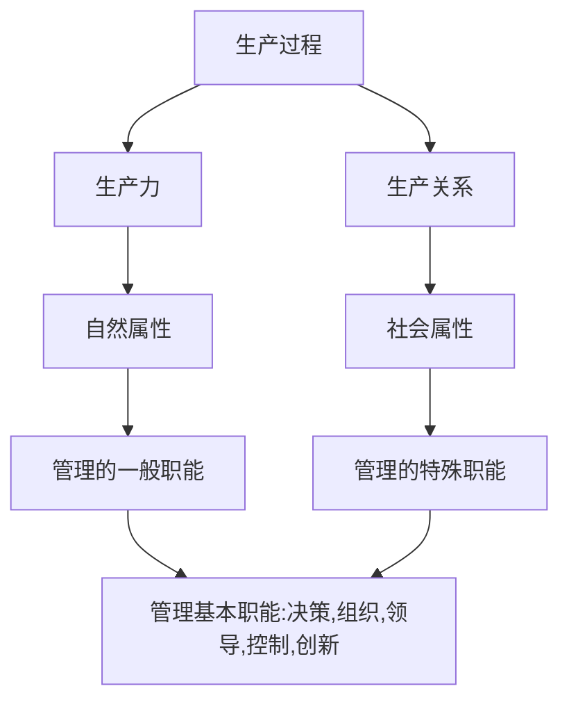

## 1.1 管理的起源与内涵

### 1.1.1 协调的方法（手段）

> 生产、组织、战争、贸易、道德、管理

### 1.1.2 管理内涵、定义

管理的定义分为几大类：
- 强调管理的作用
- 强调决策的作用
- 强调管理者个人的作用
- 强调管理工作的内容
- 其他
> 我国学者定义：
>
> 管理是组织为了达到个人无法实现的目标，通过各项职能活动，合理分配、协调相关资源的过程。——周三多
>
> 管理是对组织中的有限资源进行有效整合，以达成组织既定目标与责任的动态创造性活动。——芮明杰

**本书的定义**：管理就是为了有效地实现组织目标，由管理者利用相关知识、技术和方法对组织活动进行**决策、组织、领导、控制并不断创新**的过程。（**职能：计划、组织、指挥、协调、控制**）

### 1.1.3 基本特征：

1. 管理的**目的**是有效地实现组织预定的目标。
2. 管理的**主体**是具有专门知识、利用专门技术和方法来进行专门活动的管理者。
3. 管理的**客体**是组织活动及其参与要素。
4. 管理是一个包括多阶段、多项工作的综合过程：**决策、组织、领导、控制、创新**……

> 任何管理活动都需要管理，如果没有管理活动协调时，集体中每个成员即使目标一致，由于没有整体的配合，也可能无法实现总体的目标。

### 1.1.4 管理的二重性

**管理二重性**是指管理的**自然属性**和**社会属性**。管理的二重性是**马克思主义关于管理问题的基本观点**。

- 自然属性
  - 质量管理
  - 库房管理
  - 定额管理
  - 成本管理
  - 财务管理
- 社会属性
  - 组织目标
  - 组织道德
  - 领导作风
  - 管理理念
  - 人际关系
  - 群体价值观
  - 组织文化

#### 不同社会形态的二重性

- 资本主义企业管理的二重性表现在：一方面，它是劳动过程进行的必要条件，反映了社会化大生产的一般要求；另一方面，它又是对资本主义价值增值过程进行的管理、监督和调节，**体现了资本主义生产关系的实质。**
- 社会主义企业管理的二重性表现在：一方面，它的一般性质仍然是合理组织生产力，组织社会化大生产；另一方面，它的特殊性质就在于，**管理的权力属于劳动者，管理的目的是发展社会主义生产，满足社会全体成员日益增长的需要。**

### 1.1.5 管理的特点

- 动态性（理论结合实际）
- **艺术性**（管理者对管理技巧的应用）
  
	>即强调管理的实践性。管理人员必须在实践中积极发挥主动性、创造性，不能“死背硬套"原理，应根据实际情况，将管理知识与具体管理活动相结合。

- 经济性（资源配置需要成本）
- 创造性（管理方式随对象而转变）
- **科学性**（有科学规律可循）
  
  > 管理作为一个活动过程，其间存在着一系列基本客观规律，我们称管理是一门科学，是因为它以反映管理客观规律的理论和方法作指导，有一套分析问题、解决问题的科学方法论。

> 管理无定式——根据组织内外部环境对管理作出相应调整（管理中的权变）

### 1.1.6 管理职能
#### （一）法约尔

 ***计划、组织、指挥、协调、控制***

#### （二）古利克和厄威克

计划、组织、人事、指挥、协调、报告、预算

#### （三）哈罗德·孔茨和西里尔·奥康奈里奇

计划、组织、人事、领导、控制

#### （四）本教材

**决策、组织、领导、控制、创新**

> 为什么要将管理按照职能进行划分？

管理职能把管理过程划分为几个相对独立的部分，在理论研究上能更清除地描述管理活动地整个过程，有助于实际地管理工作以及管理教学工作。
划分管理职能，管理者在实践中有助于实现管理活动的专业化，使管理人员更容易从事管理工作。在管理领域中实现专业化，如同在生产中实现专业化一样，能大大提高效率。

## 1.2 管理的基本原理
- **人本原则**
  > 人是组织的中心，也是管理的中心，人本原理应当是管理的**首要原理**。
  **以人为中心**的人本原理要求对组织活动的管理既是**依靠人的管理**，也是**为了人的管理**。

- **整分合原则**
  > 系统原理：系统是指由若干相互依存、相互作用的要素或子系统组> 合而成的具有特定功能的有机整体。根据不同的标准，系统可以分> 成不同的类型。
  >
  > *系统形成方式*：自然系统、人造系统
  >
  > *系统是否与环境相互作用*：封闭系统、开放系统
  >
  > *系统状态是否发生变化*：静态系统、动态系统
  >
  > **系统的特征**：整体性、相关性、有序性、与外部环境的互动性。
  > 
  > **1. 管理活动所要处理的每一个问题都是系统中的问题**
  > 
  > **2. 管理必须有层次观点**
  >
  > **3. 管理工作必须有开发观点**

- 适度管理原则
  
	> 管理活动中存在许多相互矛盾的选择，必须在两个极端之间找到最恰当的点，进行适度管理，实现适度组合。

- 效益原则
  
	> 效益是指组织目标的实现与实现组织目标所付代价之间的一种比例关系。追求组织活动的效益就是**尽量以较少的资源消耗去实现组织既定的目标**。

- 弹性原则
- 反馈原则
- 动力原则

## 1.3 管理者

### 1.3.1 管理者与非管理者

管理者：利用别人的力量，指挥他人完成具体工作的人。

非管理者：从事靠自己的力量完成某项具体任务的工作的人。
### 1.3.2 管理者与领导者

不同点在于：**权力来源的途径**；**领导的方式**：（管理者**正确的做事**、**效率**，领导者**做正确的事**，**效果**）

### 1.3.3 管理者的分类

#### （一）按照层级划分

- 高层管理者：总体战略的制定，激励指导控制下属人员（管理组织）
- 中层管理者：贯彻执行高层管理者的任务（管理管理者）
- 基层(一线)管理者：接受中层管理者的指导，向员工传递信息（管理工人）

**管理者与职能：**

层次-职能|计划|组织|领导|控制
:-:|:-:|:-:|:-:|:-:
高层管理者|**28%**|**36%**|22%|14%
中层管理者|18%|**33%**|**36%**|13%
基层管理者|15%|24%|**51%**|10%

#### （二）Minceberg 的管理者角色

- 决策角色：企业家、解决问题者、资源分配者、谈判者
- 信息角色：搜讯人、传讯人、发言人
- 人际关系角色：代表人、领导人、联络人

### 1.3.4 管理者技能

- **一般技能**
  - 技术技能
  - 人际关系技能
  - 概念技能
  > 高层：概念技能（技术技能弱）
  >
  > 中层：基本均衡
  >
  > 基层：技术技能（概念技能弱）

- **特殊技能**
  - 创新能力
  - 转化能力
  - 应变能力
  - 组织协调能力

## 1.4 管理学及其研究方法

**管理学概念**：是指人类长期从事管理实践活动的科学总结，是以企业组织为重点，研究管理活动过程及其基本规律和一般方法的科学。

### 1.4.1 管理学与经济学

管理学：管理方法和技术；不强调唯一正确性；因地制宜；操作性

经济学：经济规律；具有必然性；重视理性思考；提取主要因素

### 1.4.2 公共管理与工商管理

公共管理：以公共组织为依托，以实现公共利益为目的，向特定区域内社会成员提供公共服务活动进行公共事物管理的活动。（**公共利益；公平、正义、秩序；公共权力**）

工商管理：以工商企业组织为主体，在市场经营中向顾客提供服务或出售商品获取经济利润为目的的经营管理活动。（**个人利益；利润；私人所有权**）

### 1.4.3 管理学研究方法
- 唯物辩证法
> 马克思和恩格斯

- 系统方法（整体性、目的性、开放性）
> 美籍奥地利人、理论生物学家 L.V.贝塔朗菲 1932 年提出系统论

- 案例方法（强调故事的**真实性**）
> 美国哈佛大学法学院
> 所有的案例都是事件，但并不是所有的事件都可以成为案例
>
> 所有的案例都是故事，但并不是所有的故事都可以成为案例
>
> 所有的案例都是对事件的描述，但并不是所有对事件的描述都可以成为案例

- 实验模拟
- 比较研究法
- 调查研究
- 定量分析方法