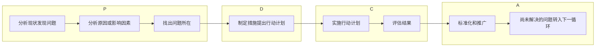

## 9.1 计划的基本概念

**概念**：计划是一种**普遍的和连续的执行功能**，它是一个包括环境分析、目标确定、方案选择的**过程**。（一种协调过程）

**作用**：

- 指明方向、协调工作
- 预测变化、降低风险
- 降低浪费、减少重叠
- 设立目标、建立标准

**内容**：

- What--具体活动和内容
- When--活动时间
- Where--活动的地点
- Who--人员安排
- How--手段与方法
- Why--组织的目标

**性质**：

- **首位性：必须先计划目标以及如何实现目标（计划是第一位的）**
- 目的性：任何组织和个人制定计划都是为了有效地达到某种目标
- 普遍性：
  - 对组织：都必须有相应的计划
  - 对管理者：必须服从计划工作
- 有效性：计划的效率，可以用计划对组织的目标的贡献来衡量。
  - 有效实现组织与外部环境的协调
  - 实现组织内部的协调，使投入产出最佳
  - 组织目标和个人目标的协调
- 科学性：通过管理者的精心规划，使那些本不可能发生的事成为可能。
  - 正确的科学方法
  - 可靠的科学依据
  - 求实的科学态度
- 秩序性
  - 要求纵向层次性和横向协作性

## 9.2 计划的分类

- 按照计划的广度：
  - 战略计划
  - 战术计划
- 按照计划的期限
  - 长期计划（5 年以上）
  - 中期计划（1 年以上、5 年以下）
  - 短期计划（1 年或 1 年以内）
- 按照计划的明确程度
  - 指导性计划
  - 具体计划
- 按照计划的涉及活动内容
  - 综合计划
  - 专业计划
  - 项目计划

## 9.3 计划的编制与推进

### 9.3.1 计划编制过程

- 制定计划目标（一个组织在同一时期可能有多个目标）
  - 明确主题
  - 期望达到的数量或水平
  - 可用于测量计划实施情况的指标
  - 明确的时间期限
- 估量现状与目标之间的差距
  - 在现状的基础上力求改进，逼近目标
  - 变革现状，甚至是根本性的调整
- 预测未来情况——从定性或定量的方法预测未来情况
- 制定计划方案（并制定应急计划，或称权变计划）

### 9.3.2 计划编制方法

#### （一）滚动计划法

按照“近细远粗”的原则制定一定时期内的计划，根据情况**调整和修订未来的计划，并逐期向后移动**。是一种**把近期计划和长期计划结合**起来的编制计划的方法。

优点：

- 使计划更加贴合实际，相对缩短了计划期，加大了对未来估计的准确性，提高了计划的质量。
- 使长、中、短期计划相互衔接，使各期计划保持一致性。
- 大大增强了计划的弹性，可以提高组织的应变能力。

#### （二）计划评审技术(PERT)

- 确定完成项目必须进行的每一项有意义的**活动**， 完成每项活动都产生**事件或结果**。
- 确定活动完成的**先后次序**。
- 绘制活动流程从**起点到终点的图形**，用**圆圈表示事件，用箭线表示活动**，得到的一副箭线流程图，称之为**PERT 网络**。
- 估计和计算每项活动的完成时间。
- 借助网络图，管理者制定全部项目的日程计划，在关键路线上没有松弛时间。
- 

#### （三）甘特图

由**亨利·甘特**开发，是一种**线状图**，**横轴表示时间，纵轴表示安排的活动，线条表示在整个期间上计划和实际的活动完成情况**。

### 9.3.3 计划的推进

#### 目标管理

德鲁克认为：企业的目的和任务必须转化为目标。

**目标管理就是一种以工作为重心和以人为本的管理哲学进行综合的系统管理思想**。

目标管理指导思想是以**Y 理论为基础的(依靠雇员自身管理来完成目标，管理者进行考核)**，即认为在目标明确的条件下，人们能对自己负责。目标管理与传统管理的共同要素：**明确目标、参与决策、规定期限、反馈绩效**。

> 具体方法上是泰勒科学管理的进一步发展
>
> 确定总目标，然后决定分目标……

**优点**：提高雇员的**绩效**和组织的**生产率**

**缺陷**：制定目标的困难、强调短期目标、缺乏灵活性、其他危险（雇员过分关注自己的目标，而不考虑工作单位内其他人的目标）

#### 目标管理程序

##### 制定目标的原则（SMART 原则）

- 目标必须具体（**Specific**）
- 目标必须可衡量（**Measurable**）
- 目标必须可达到（**Attainable**）
- 目标必须和其他目标具有相关性（**Relevant**）
- 目标必须具有明确的截止期限（**Time-based**）

##### 目标展开

- 目标分解
- 对策展开
- 明确目标责任

##### 目标实施与评价

- 目标实施：
  - 实施中的检查
  - 实施中的控制
  - 实施中的修正
- 目标评价：把总结的经验用于下一目标周期

#### 计划的推进：PDCA 计划循环法

**PDCA：Plan（计划）、Do（执行）、Check（检查）、Action（总结处理）**，由美国管理专家**戴明**提出，又称为“戴明循环管理法”。

**PDCA 循环的具体步骤**

- **P**：
  - 提出工作设想，收集资料、调查预测，确定方针和目标
  - 按规定的方针目标，进行试算平衡，提出各种决策方案，从中选择一个最理想的方案
  - 按照决策方案，编制具体的活动计划下达执行
- **D**:
  - 根据规定的计划任务，具体落实到各部门和有关人员
- **C**：
  - 检查计划的执行情况，评价工作成绩。在检查中，必须建立和健全原始记录和统计资料，以及相关的信息情报资料
  - 对已发现的问题进行科学分析，从而找出问题产生的原因
- **A**：
  - 对发生的问题提出解决方法
  - 对尚未解决的问题，转入下一轮 PDCA 工作循环予以解决

#### 计划的推进：预算

**预算**：国家机关、团体或事业单位等对于未来的一定时期内的收入和支出的计划。

**预算的内涵**

- 预算管理是一种**计划思想**的体现
- 预算的编制是作为计划的一部分而开始，同时预算也是计划过程的终点
- 预算管理是**预测方法**的运用
- 预测是对未来一个时期内的收支情况的预计
- 预算管理是一种**控制手段**
- 预算的编制实际是控制过程的第一步——拟定标准

**分类**

- 固定预算：又称静态预算，一般金额不变

- 弹性预算：可能发生变动

- 增量预算：**在上期成本费用的基础上**，根据预计的业务情况，再结合管理需求，调整有关费用项目

- 零基预算：**不考虑以前发生的费用项目和金额**，从零开始

  > 零基预算与其他预算的不同：
  >
  > - 预算的基础不同：基础是零，本期的预算额是根据本期经济活动的重要性和可供分配的资金量决定的
  > - 预算编制分析的对象不同：对预算期内所有经济活动进行成本——效益分析
  > - 预算的着眼点不同：从业务活动的必需性和重要程度来分配有限的资金