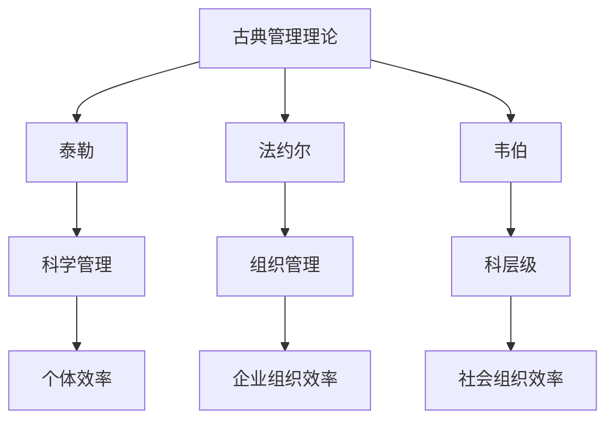
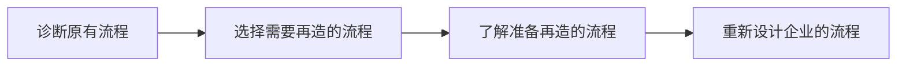

## 2.1 中国管理思想

### 2.1.1 中国古代管理学思想

1. 儒家：**孔子**，**以仁为核心、以礼为准则，义用来协调**；孟子，性善论、修身齐家治国平天下；荀子，性恶论
2. 道家：老子，**无为而治**，让事物按照自身的必然性发展；庄子
3. 法家：韩非，**以奖惩的强制手段来求得社会公平**，提倡用人唯贤，重农主义，崇尚法先王、复古（**反对礼治，注重法治**）
4. 墨家：墨子，**博爱、节用、尚贤（爱下属，节约扩大生产，中用德才兼备之人）**
5. 兵家：孙子，“故上兵伐谋，其次伐交，其次伐兵，其下攻城。”，“进不求名，退不避罪，唯人是保，而利合于主，国之宝也。”
6. 阴阳家：**平衡、和谐**

### 2.1.2 中国近代管理思想

- 行政管理
  - 张之洞：旧学为体，新学为用
  - 康有为：君主立宪
  - 孙中山：三民主义
- 经济管理
  - 魏源：师夷长技
  - 李鸿章：官督商办（盛宣怀）
- 企业管理
  - 荣氏：勇于开拓创新
  - 刘氏：风险管理

### 2.1.3 中国现代管理
- 邯郸钢铁
- 海尔战略
- 小米
- 互联网+

## 2.2 西方古典管理理论

### 2.2.1 西方早期管理学思想

1. 行政管理思想
2. 生产管理思想
### 2.2.2 西方管理理论先驱

- 亚当·斯密（英国）：《国富论》，劳动分工
- 查尔斯·巴尔奇（英国）：运用数学模型来管理，科学管理
- 罗伯特·欧文（英国，空想社会主义者）：重视人，缩短工时……人事管理

### 2.2.3 西方管理理论的形成与发展

形成：工厂制度的诞生

1. 机器生产代替手工劳动
2. 自然力代替人力
3. 现代雇佣制度的确立
4. 管理者与被管理者的界限分明

#### (一）西方管理理论——古典理论

**特点**：

- 基于“经济人”的人性假设
- 出发点：经济利益驱动
- 管理手段：“胡萝卜”+“大棒”
- 研究方法：**静态**研究管理的一般过程

##### 1. 科学管理思想

**泰勒**（美国）：19 世纪末期，工业化发展，磨洋工现象；以**工人个体**为研究对象

**四次实验**：泰勒实验、金属切削实验、铁锹实验、搬运实验

**贡献**：

  - 第一次使管理从经验上升为科学
  - 讲究效率和调查研究
  - 计划和执行相分离

**局限性**：

  - 对工人的看法是错误的
  - 仅重视技术，不重视人
  - 内容窄，局限于车间管理

##### 2.行政管理思想

**法约尔**（法国）：以**企业组织**为研究对象；首次提出一般管理理论；管理过程之父、现代经营管理之父。

企业全部活动可以概括为六种：

  1. 技术性工作
  2. 商业性工作
  3. 财务性工作
  4. 会计性工作
  5. 安全性工作
  6. 管理性工作
     
     > **计划、组织、指挥、协调、控制**

提出管理的 14 条原则

**法约尔跳板/法约尔桥**：减少了不必要的权利距离

**评价**：
  - 更具一般性
  - 提出了管理理论框架
  - 原则经过多年证明有效

##### 3.一般管理思想

**马克斯·韦伯**（德国）：以**社会组织**为研究对象，韦伯的行政管理理论也称为**科层制**或**官僚制**。稳定、严密、有效、准确。

**三种权威**：

  1. 传统权威：依赖于传统或习俗的权利，不利于社会变革，往往非理性、不一致
  2. 魅力权威：领导者的使命和愿景激励他人形成的权利基础，合法性基于信念
  3. **理性法定权威**：以理性和法律规定为基础行使权威。能形成一个**客观、具体**的组织结构。

**韦伯的理想官僚行政组织的主要特征**：

  - 劳动分工
  - 职权等级
  - 正式的选拔
  - 正式的规则和制度
  - 非人格性
  - 职业定向

**科层制的缺陷**：

- 过分强调机械性的正式组织层面而忽略组织动态面
- 目标错置，例如：过分重视法规而使人员僵化
- 层级节制削弱上级对下级的影响力
- 训练有素的无能
- 永业化使人员丧失斗志
- 升迁按年资事人员忽略服务对象的利益
- 官僚体制是理想的建构故缺实证基础

#### （二）西方管理理论——行为科学

**早期行为科学**：
- 雨果
- 罗伯特
- 玛丽
- 巴纳德的组织理论

**中期行为科学**：
- 霍桑研究
- 照明试验
- 继电器装配试验
- 接线板接线工作室试验

**后期行为科学**：

- 人际关系
- **行为科学：是指利用许多学科的知识来研究人类行为的产生、发展和变化律，以预测、控制和引导人的行为，达到充分发挥人的作用，调动人的积极性的目的。**

**霍桑实验**：

  1. **照明实验**（车间照明实验）：**灯光亮度不影响产量。**
  2. **福利实验**（继电器装配实验）：**梅奥**（美国）参加；福利不影响产量，后来产量上升原因为：**参加实验的光荣感**，**成员间良好的相互关系**
  3. **访谈实验**（大规模的访谈计划）：倾听工人想法，产量大幅提高。
  4. **群体实验**（继电器绕线组的工作室实验）：组织内部存在自发形成的**非正式群体**，这种群体有自己的特殊的行为规范，对人的行为起着调节和控制作用，还加强了内部的协作关系。

**霍桑实验的结论：**
1. 职工是**社会人**，生产效率取决于职工的积极性和职工的家庭关系与人际关系。（福利实验）
2. 企业中存在**非正式群体**，规范着小团体成员的感情倾向和行为。（群体实验）
3. 新型的领导能力在于提高职工的满足度，管理人员要同时具有**经济能力**和**人际关系能力**。（访谈实验）
4. 存在**霍桑效应**，对于新环境的好奇和兴趣，导致了较佳的成绩，至少在最初阶段如此。
   
   > 霍桑实验的结论冲击了**经济人**的假设，引发出**社会人**的假设。

**行为理论**：
马斯洛的**需要层次理论**：
> 生理需要->安全需要->社交需要->自尊需要->自我实现需要

## 2.3 现代管理理论
**管理丛林**： 美国孔茨教授提出

### （一）管理过程学派
**代表人物**：法约尔，哈罗德·孔茨

**管理的职能**：计划、组织、人事、领导和控制

**管理的本质**：协调

### （二）社会系统理论
**代表人物**：巴纳德

**主导方向**：协调组织中个人与组织之间的关系

**观点**：组织是一个由个人组成的协作系统，个人只有在一定的相互作用的社会关系下，同他人协作才能发挥作用。经理人员的作用是充当系统运转中心，对组织人员进行协调。

### （三）管理科学学派
又称**数理学派**

**代表人物**：伯法（美国）

**内容**：把管理看成是一个数学模型和程序的系统。

**理论**：只要管理、组织、计划、决策是一个逻辑过程，就能用数学符号和运算关系来予以表示。

**方法**：模型

### （四）系统管理学派
**代表人物**：弗里蒙特·E·卡斯特

**内容**：从企业整体的要求出发，处理好企业组织内部各个单位或部门之间的相互关系，保证组织整体的有效运转。

**理论**：任何组织都是由若干子系统构成；企业是一个人造的开放系统；通过各个子系统之间的协调实现组织大系统的整体优化。

### （五）经验主义理论
**代表人物**：彼得·德鲁克，欧内斯特·戴尔，艾尔弗雷德·斯隆，威廉·纽曼等。

**基本管理思想**：管理学就是研究管理经验，通过研究管理中成功经验或失误，就能理解管理问题，就自然学会了进行有效的管理。

**管理实践**：针对泰勒的“计划、执行职能相分离”（忽视工人兴趣），提出**目标管理（MBO）**。

> 德鲁克的观点：**任务决定管理**

### （六）决策学派
**代表人物**：西蒙

**观点**：管理的核心是**决策**

**内容**：

1. **决策是个复杂的过程**：决策应分为四个阶段：提出指定决策的理由；尽可能找出所有行动方案；在诸方案中进行抉择，选出最满意的方案；对该方案进行评价。
2. 决策可以分为**程序化决策**和**非程序化决策**。
3. **制定一套令人满意的行为准则**
4. **组织设计的任务就是建立一种制定决策的人-机系统**

### （七）权变管理理论

**代表人物**：卢桑斯、费德勒、豪斯

**观点**：传统管理理论面对企业瞬息万变的外部环境无能为力，需要有一种管理取决于所处环境状况的理论，即**权变**（权宜应变）。

**内容**：通过大量事例的研究和概括，把各种各样的情况归纳为几个基本类型，并给每一类型找出一种模型。

**理论**：
- 权变管理意味着环境变化同管理之间存在着一种积极的相互关系。
- 管理实践本来就是要求管理者在应用理论和方法时要考虑现实情况。
- 一般权变变量包括：**组织规模、任务技术、环境的不确定性、个人差异**。

### （八）经理角色学派

**代表人物**：明茨伯格

**主要观点**：总经理们并不按人们通常认为的那种职能分工行事，而是还进行许多别的工作。

**经理扮演着 10 种角色**：

- 人际关系方面 3 种
- 信息方面 3 种
- 决策方面 4 种

## 2.4 现代管理理论的发展

- **从过程管理转向战略管理**

- **从产品的市场管理转向价值管理**

- **从行为管理转向文化管理**

### 2.4.1 战略管理理论

- 结构学派：迈克尔波特：五力模型；三种基本竞争战略
- 资源学派：**柯斯**：资源的不可模仿性、持久性、占有性、替代性、竞争性
- 能力学派：汉默尔：核心能力观；斯多克：整体能力观

### 2.4.2 文化管理

#### x-y 理论

> X 理论认为人们有消极的工作[源动力](https://baike.baidu.com/item/源动力)，而 Y 理论则认为人们有积极的工作源动力

#### Z 理论

**代表人物**：威廉大内（日裔美籍学者）

**理论**：
- 雇佣期限（长期雇佣）日
- 决策方式（集体决策）日
- 职责的归属（个人负责）美
- 评价和晋升的速度（缓慢的评价和晋升）日
- 控制的过程（含蓄与明确兼用的控制）
- 职业途径（适度专业化职业途径）
- 关怀员工（全面关怀员工）日
- 是日美两种管理模式的融合（中间路线）

### 2.4.3 全面质量管理

**代表人物**：戴明
- 强烈关注顾客
- 坚持不断改进
- 改进组织中每项工作的质量
- 精确的度量
- 向雇员授权

### 2.4.4 学习型组织理论

**代表人物**：彼得圣吉

**五项修炼**：
  1. 追求自我超越
  2. 改善心智模式
  3. 建立共同愿景目标
  4. 开展团队学习
  5. 锻炼系统思考能力

### 2.4.5 企业再造理论

**代表人物**：迈克尔哈默，詹姆斯钱皮

> 根据当今社会的需求，对组织流程进行再造

**特点**：向过去的结构挑战；变革的彻底性；大跃进式发展；从业务流程开始

> 所谓**企业再造**，就是以工作流程为中心，重新设计企业的经营、管理及运作方式。

### 2.4.6 其他概念（看看就好）
**供应链**：围绕核心企业，通过对信息流，物流，资金流的控制，从采购原材料开始，制成中间产品以及最终产品，最后由销售网络把产品送到消费者手中的将供应商，制造商，分销商，零售商，直到最终用户连成一个整体的功能网链结构。

**企业关键绩效指标**（KPI：Key Performance Indicator)：理论基础是二八原理（由意大利经济学家帕累托提出）

**ERP**：ERP 是针对物资资源管理(物流)、人力资源管理(人流)、财务资源管理(财流)、信息资源管理(信息流)集成-体化的企业管理软件。ERP 系统中的计划体系主要包括:主生产计划、物料需求计划、能力计划、采购计划、销售执行计划、利润计划、财务预算和人力资源计划等，而且这些计划功能与价值控制功能已完全集成到整个供应链系统中。

### 2.4.7 发展阶段

**MRP 阶段**(Material Requirement Planning)

**MRP II 阶段**(Manufacture Resource Planning)

**ERP 阶段**(Enterprise Resource Planning)