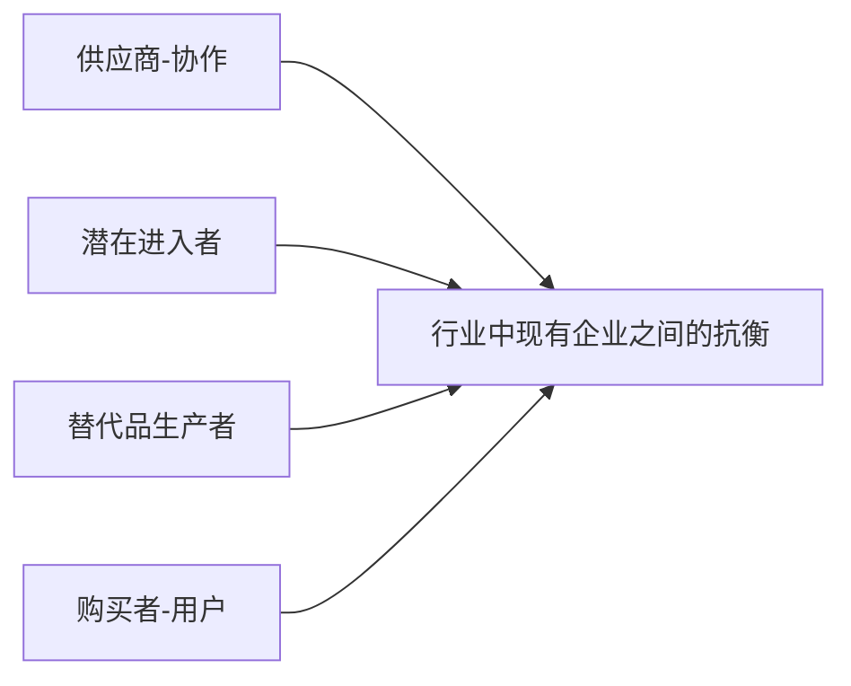
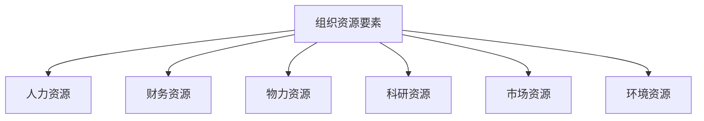
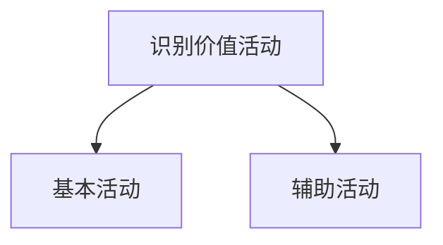
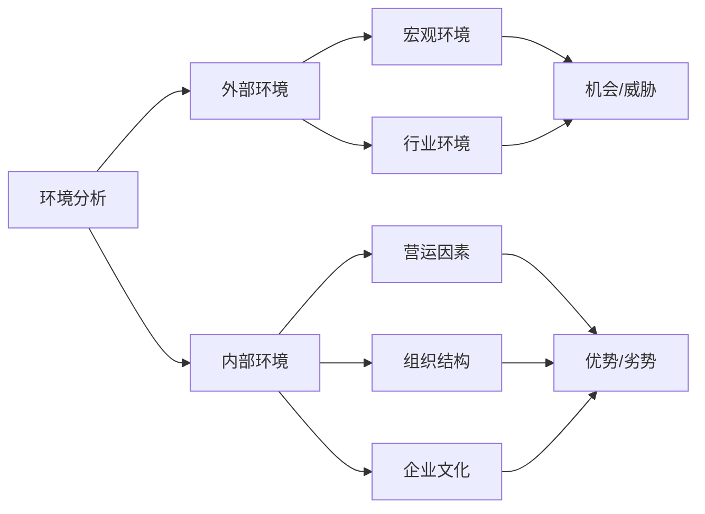

## 5.1 管理与环境

**内部环境**：

- **文化环境**：组织长期发展出的稳定独立的价值观
- **组织经营条件**：组织拥有资源的数量与质量

**外部环境**：

- **一般环境**：宏观环境，相关性不强的或间接因素
- **特殊环境**：微观环境，对某一特定组织产生直接影响的外部环境

**环境变化程度**：

- 稳态
- 动态

**环境复杂程度**：

- 简单
- 复杂

| 复杂程度/变化程度 |                             稳态                             |                             动态                             |
| :---------------: | :----------------------------------------------------------: | :----------------------------------------------------------: |
|     **简单**      |                如日用品 策略：纪律、计划                | 如音像制品 策略：调整内部组织管理 纪律仍占主要地位 |
|     **复杂**      | 如汽车制造产业 策略：分权，根据不同资源 条件组织各自动活动 | 如高新技术产业 策略：权力分散下放 各自相对独立决策 |

**管理与环境的关系**：

- 环境对供应商的作用：影响供应商的数量、类型以及产品
- 环境对企业产品替代的作用：例如打火机替代火柴
- 环境对行业边界的作用：国进民退现象
- 环境对顾客行为的作用：影响企业顾客的多少、分布特征

**环境研究意义**：

- 环境是企业生存发展的土壤
- 外部环境影响内部环境的管理关系
- 环境对组织的作用有两面性
- 外部环境影响企业经营管理特色（国民文化）

**全能观点**：管理者能够克服任何障碍去实现组织目标；一切都是由于管理者的决策行动差异所致。

**象征观点**：管理者对成果的掌握能力，会受到外部因素的影响；管理者的作用很小。

> 这两种观点都有一定的局限性。

## 5.2 外部环境分析

### 5.2.1 外部宏观环境分析

**PEST**：

- P：Politics 政治
- E：Economy 经济
- S：Society 社会
- T：Technology 技术

**政治法律环境**：指一个国家或地区的政治制度、体制、方针政策、法律法规等方面

> **政治环境对企业的影响特点是：直接性、难于预测性、不可逆转性**

**法律环境**：法律规范、国家司法执政机关、企业的法律意识、国际法规定的国际法律环境和目标国的国内法律环境

**政治环境**

**经济环境**：指构成企业生存和发展的社会经济状况和国家经济政策

- 社会经济结构
- 经济发展水平
- 经济政策
- 经济体制
- 其他经济指标、利率、汇率等

**文化环境**：社会性质、价值观、人口状况、教育状况、风俗习惯、宗教信仰等

> 文化和人口互相影响
>
> 文化环境影响企业文化，人口因素影响企业战略

**技术环境**：企业所处的社会环境中的技术要素与该要素直接相关的各种社会现象的集合

- 社会技术水平
- 社会技术力量
- 技术体制
- 国家的技术政策和技术立法

### 5.2.2 ▲任务环境分析（特殊/行业环境分析）：波特五力模型

1. 行业现有竞争：

	- 集中程度
	- 产品差异性
	- 成本状况、规模经济和固定与可变比率
	- 剩余生产能力和退出障碍

	> 进入退出障碍，剩余产能：从行业利润的角度来看，最好的情况是**进入壁垒较高，退出壁垒低**

2. 替代产品或服务的威胁：

	- 买方对替代品的态度
	- 替代品的性能价格特征

3. 新进入者的威胁

	- 规模经济
	- 资本需求
	- 绝对成本优势（成本摊薄）
	- 产品差异（品牌的优势）
	- 分销渠道（超级渠道商）
	- 政府政策和法律（国家垄断）
	- 反击（报复）

4. 供应商的议价能力

5. 客户的议价能力

	- 买卖双方规模的相对大小和集中程度
	- 购买者信息的完全程度
	- 产品差异化程度
	- 纵向一体化程度

## 5.3 内部环境分析

内容：主要是分析各种资源的拥有状况和利用能力。

主要分为**组织资源分析**和**组织能力分析**。

### 5.3.1 组织资源分析

内容：从全局来把握企业资源在量、质结构和分配、组合方面的情况。

### 5.3.2 企业价值链分析

**价值链分析**：将企业活动分解，考虑单个活动本身及其相互关系来确定企业竞争优势。**是所有增加价值的步骤组成的一系列活动，这些经营活动就是价值链商的“战略环节”**。（美国迈克尔·波特提出）

> **本质：寻找企业价值增殖过程中涉及的活动**

基本活动包括：内部后勤、生产经营、外部后勤、市场营销、服务

辅助活动包括：采购、技术开发、人力资源、基础设施

**特点**：

- 可分为两种活动：**基本活动**和**辅助活动**
- 列示了总价值；价值链除了价值活动还包括利润
- **分析的基础是价值，重点是价值活动分析**
- **整体性**，企业的价值链体现在更广泛的**价值系统**中

### 5.3.3 组织环境管理

> 环境的不确定性给组织带来了很大的影响，所以组织需要对这些因素进行分析，管理环境。

管理环境的方式：**适应环境**或**影响环境**

**SWOT 分析模型**

> **优势-S Strengths 
> 劣势-W Weaknesses 
> 机会-O Opportunities
> 威胁-T Threats**

- **SO 战略**：内部优势+外部机会   增长型战略
- **WO 战略**：内部劣势+外部机会   扭转型战略
- **ST 战略**：内部优势+外部威胁   多种经营战略
- **WT 战略**：内部劣势+外部威胁   防御型战略 