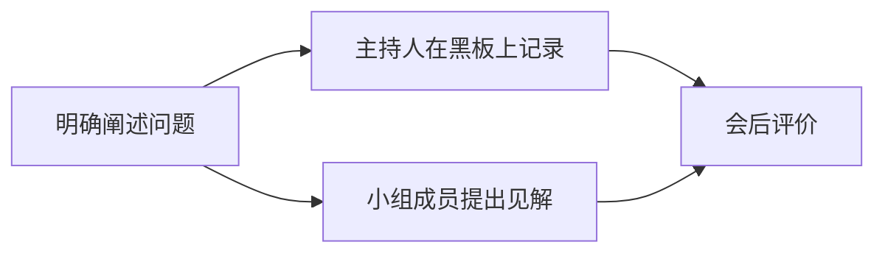
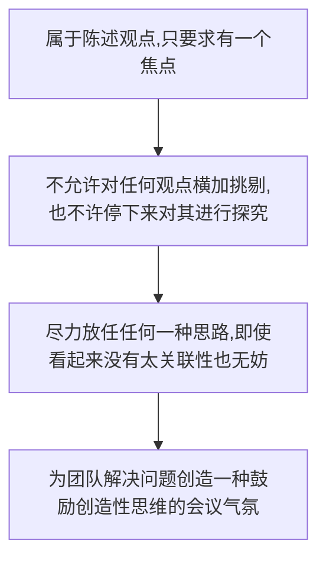
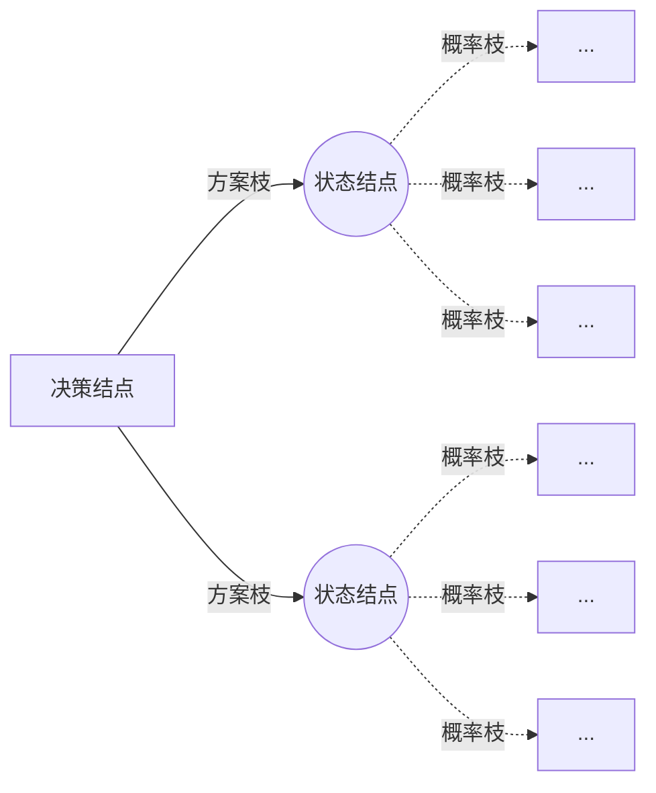

## 8.1 定性决策方法

### 8.1.1 德尔菲法

来源：德尔菲法是在 20 世纪 40 年代由**O.赫尔姆**和**N.达尔克**首创，经过**T.J.戈尔登**和**兰德公司**进一步发展而成的。

也称为**专家调查法**，是一种**采用通讯方式**分别将所需解决的问题单独发送到各个专家手中，征询意见，然后回收汇总全部专家的意见，并整理出综合意见。**多次反复，逐步循环**，取得比较一致的预测结果和决策方法。

### 8.1.2 头脑风暴法





**来源**：美国学者**阿历克斯·奥斯本**（现代创造学的创始人）。

**特点**：让与会者敞开思想，使各种设想在相互碰撞中激起脑海的创造性风暴。

**原则**：

- 不做任何评价
- 建议越多越好
- 广开思路
- 补充和完善

> 在**群体决策**中，由于群体成员心理相互作用影响，**易屈于权威或大多数人意见**（传统讨论会议的缺点），形成“**群体思维**”。群体思维削弱了寻提的批判精神和创造力，损害了决策的质量。

## 8.2 定量决策方法

### 8.2.1 确定性决策法

**条件**：

- 存在着决策人希望达到的一个明确目标
- 只存在一个确定的自然状态
- 存在着可供选择的两个或两个以上的行动方案
- 不同的行动方案在确定状态下的损失或利益值可以计算出来

**方法**：

- **线性规划**
- **盈亏平衡分析**（保本点分析或本量利分析法）：根据业务量、成本、利润之间的相互制约关系的综合分析，用来预测利润，控制成本，判断经营状况的一种数学分析方法。

### 8.2.2 风险性决策法

#### 决策矩阵

**基本要素**：

- 状态变量：可能影响决策后果的各种客观外界情况或自然状态，是不可控因素。
- 决策变量：决策者所采取的各种行动方案，是可控因素。
- 概率：各种自然状态出现的概率。
- 损益值：在一种自然状态下选取某种方案所得结果的损益值。

> 例：某工厂生产面包：当天销售一个面包可获利 2 元，如果当天没有卖出则亏损 1 元，每天市场的面包需求量为：0、1000、2000、3000；且市场需求每种状态的概率为 0.1、0.2、0.5、0.2，工厂的生产计划有 0、1000、2000、3000，请问如何进行决策制定最优的生产计划？
>
> 答：由决策矩阵得出应每天生产 2000 个
>
> | 生产/需求(概率) | 0(0.1) | 1000(0.2) | 2000(0.5) | 3000(0.2) | 期望 |
> | :-------------: | :----: | :-------: | :-------: | :-------: | :--: |
> |        0        |   0    |     0     |     0     |     0     |  0   |
> |      1000       | -1000  |   2000    |   2000    |   2000    | 1700 |
> |      2000       | -2000  |   1000    |   4000    |   4000    | 2800 |
> |      3000       | -3000  |     0     |   3000    |   6000    | 2400 |

#### 决策树

决策树就是将决策过程各个阶段之间的结构绘制成一张箭线图。



> 例：某企业对产品更新换代作出决策，现拟定三个可行方案：
> 第一：上新产品 A,需追加投资 600 万元，经营期 7 年，若产品销路好，每年可获利 300 万元，若产品销路不好，每年将
> 亏损 40 万元，据预测，销路好的概率为 0.6,不好的概率为 0.4；
> 第二：上新产品 B,需追加投资 300 万元，经营期 7 年，若产品销路好，每年可获利 200 万元，若产品销路不好，每年将
> 持平，据预测，销路好的概率为 0.7, 不好的概率为 0.3；
> 第三：继续维持老产品生产，若产品销路好，今后 7 年内可维持现状，每年可获利 80 万元，若产品销路不好，每年将获利 20 万元，据预测，销路好的概率为 0.8,不好的概率为 0.2；
> 试用决策树法选出最优方案?
>
> 答：由决策树得出应选第二个方案
>
> ```mermaid
> graph LR
> A[决策]--产品A-->B((A))
> B-.销路好60%.->300万/年
> B-.销路不好40%.->40万/年
> B==期望==>548万
> A--产品B-->C((B))
> C-.销路好70%.->200万/年
> C-.销路不好 30%.->0/年
> C==期望==>680万
> A--产品C-->D((C))
> D-.销路好80%.->80万/年
> D-.销路不好 20%.->20万/年
> D==期望==>476万
> ```

> 例：某市拟建预制构件厂，现有三个方案可供选择：一次投资建大厂，需投资 300 万元；一次投资建小厂，需投资 160 万元；先建小厂，三年后如果产品销路好，则再扩建，需投资 150 万元。工厂的使用年限按 10 年计算。
>
> 销路好的概率为 0.7,销路差的概率为 0.3
> 若销路好时，建大厂的损益值为 100 万元，建小厂的损益值为 40 万元；
> 若销路差时，建大厂的损益值为-20 万元，建小厂的损益值为 10 万元；
> 若前三年销路好，则后七年销路好；
> 若前三年销路差，则后七年的销路一定差。
> 试做出决策。
>
> ```mermaid
> graph LR
> A[建厂]--投资300万-->B((大厂))-.销路好0.7.->100万/年--10年总收入-->1000万
> B-.销路差0.3.->-20万/年--10 年总收入-->-200万
> A--投资160万-->C((小厂))-.销路好0.7.->40万/年--10 年总收入-->400万
> C-.销路差0.3.->E[10万/年]--10年总收入-->G[100万]
> A--投资160万-->D((先建小厂,若三年后销路好,再扩建))-.前三年销路好0.7,需再投资150万.->前三年40万/年,后七年100万/年--10年总收入-->820万
> D-.前三年销路差0.3.->F[10万/年]--10年总收入-->H[100万]
> ```
>
> ①第一种方案的期望：$E_1=[1000×0.7+(-200)×0.3]-300=340$(万元)
>
> ②第二种方案的期望：$E_2=(400×0.7+100×0.3)-160=150$(万元)
>
> ③第三种方案的期望：$E_3=[(820-150)×0.7+100×0.3)]-160=339$(万元)
>
> 综上：由于$E_1>E_3>E_2$，所以最优的决策是选择第一种方案


### 8.2.3 不确定性决策

如果各种状态发生的概率事先无法预测，决策就是不确定性决策。

**原则**：

- **乐观原则：大中取大**

- **悲观原则：小中取大**

- 折中原则：乐观系数

  > $CV_i=αmax[a_{ij}]+(1-α)min[a_{ij}]$ 其中$α$为折中系数，取$CV_i$中最大值为决策的目标值，对应的方案即为决策方案

- 后悔值原则：决策者制定决策之后，若情况未能符合理想，必将产生一种后悔的感觉；决策者以后悔值作为依据进行决策。【后悔矩阵**极大极小原则**、对比最优方案】

  > 例：$N_j$为自然状态变量，$S_i$为决策变量
  > 收益（万元）|需求大$N_1$|需求中$N_2$|需求小$N_3$
  > :-:|:-:|:-:|:-:
  > 大批量$S_1$|500|300|-250
  > 中批量$S_2$|300|200|80
  > 小批量$S_3$|200|150|100
  > $Max(S_i, N_j)$|500|300|100
  > 则后悔矩阵（**用每一列的最大值减去这一列的每一个值**）为：
  >
  > 后悔值（万元）|需求大$N_1$|需求中$N_2$|需求小$N_3$|$Max(S_i,N_j)$
  > :-:|:-:|:-:|:-:|:-:
  > 大批量$S_1$|0|0|350|350
  > 中批量$S_2$|200|100|20|**200***
  > 小批量$S_3$|300|150|0|300
  >
  > 所以选择$S_2$方案，即得到后悔矩阵后，先求每个方案的最大后悔值，最后从所有最大值中选取最小值（**极大极小原则**），本质也是在最差的方案中选择较好的方案。

- 等可能性原则