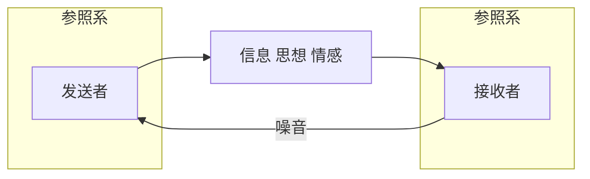
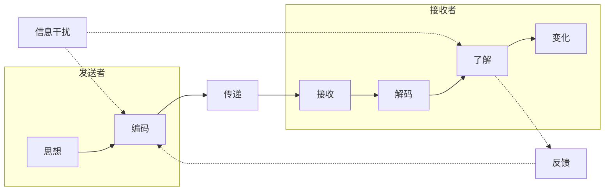
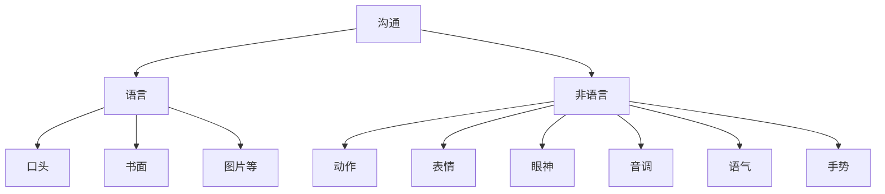

## 13.1 沟通的基本概念与分类

### 13.1.1 基本概念

> **管理职能的转变**
>
> - 传统管理的四大职能：**计划、组织、领导、控制**
> - 新的管理的四大职能：**注入活力、充分授权、给予支持、互相沟通**

**沟通**已成为管理的**基石**。

**沟通**是指通过选定的渠道，将可以理解的思想、观点、态度、情感等在两个或者两个以上的个体或者群体中进行传递或者交换的过程。

**管理沟通**是指管理者与被管理者之间、管理者之间、被管理者之间（组织内部）或者组织内部成员和组织外部的信息的传递过程。

> 沟通是“思想及信息的传递”。——《哥伦比亚百科全书》
>
> 沟通是“将观念或思想由一个人传递给另一个人的过程，或者是一个人自身内的传递，其目的是使接受沟通的人获得思想上的了解”。——布农（美国）
>
> 沟通是“互相交换信息的行为”。——《大英百科全书》
>
> 沟通是“人或团体主要通过符号向其他个人或团体传递信息、观念、态度或情感的过程”。——丹尼尔·奎尔（英国）
>
>
> 管理就是沟通，沟通再沟通。——杰克·韦尔奇
>
> 最好的想法，最有创见的建议，最优秀的计划，不通过沟通都无法实现。——斯蒂芬·P·罗宾斯
>
> 企业管理过去是沟通，现在是沟通，将来还是沟通。——松下幸之助

#### 沟通的双向性

**沟通一定是一个双向的过程**。

#### 沟通过程

> 实线为主要过程

#### 沟通的要素

- 信息
- 信息的发送者
- 信息通道
- 信息的接受者
- 反馈

#### 噪声

- 嘈杂局限的环境、特殊思想的形成 ➡ 注意力不集中
- 符号含糊不清 ➡ 误解了文字和其他符号的含义
- 传递渠道不通畅 ➡ 偏见

#### 沟通的作用

- 传递和获得信息
- 改善人际关系

#### 沟通方式

> 美国心理学家艾伯特·梅拉比安：沟通的主要成分
>
> - 7% 语言文字
> - 38% 声音
> - 55% 非语言

### 13.1.2 沟通分类

- 根据沟通符号的种类
  - 语言沟通
    - 书面沟通
    - 口头沟通
  - 非语言沟通
- 根据是否是结构性和系统性
  - **正式沟通**
  - **非正式沟通**
- 根据在群体或组织中沟通传递的方向
  - 自上而下沟通
  - 自下而上沟通
  - 平行沟通
- 根据沟通的互动性
  - 单向沟通
  - 双向沟通
- 根据发送者和接收者的角度
  - 自我沟通
  - 人际沟通
  - 群体沟通

#### 正式沟通和非正式沟通（了解）

- 正式沟通
  - 含义：通过组织明文规定的渠道进行的信息传递和交流
  - 优点：沟通效果较好，约束力较强，易于保密。适用于重要的信息。
  - 缺点：由于正是沟通依赖组织系统层层传递，沟通速度比较慢，较为刻板。
  - 类别：**链式、轮式、Y 式、环式、全通道式**
- 非正式沟通：
  - 含义：正式沟通渠道以外进行的信息传递和交流
  - 优点：方便、内容广泛、方式灵活、沟通速度快；能提供一些正式沟通中难以获得的信息
  - 缺点：比较难控制，信息的不确定性高
  - 类别：**集束式、随机式、单线式、流言式**

- 正式沟通渠道：正式沟通渠道是通过组织正式结构或层级系统运行，由组织内部明确的规章制度所规定的渠道进行的信息传递与交流
  - 类型：
    - **下行沟通**：信息从较高层级向较低层级流动；是**传统组织内最主要的沟通渠道**
    - **上行沟通**：较低层向较高层；使管理者能够了解员工的想法与需要
    - **平行沟通**：信息在组织同层级之间流动，包括同层级的人员和部门；减少层级之间的辗转、节约时间、提高工作效率、有利于相互间的协调与配合
  - 类别：
    - **链式**：单向、顺次；**容易失真、联系面狭窄、平均满意度低**
    - **轮式**：所有成员都是通过与中心成员沟通来完成群体目标；**速度和准确度高、中心成员控制力强；其他成员满意度低**
    - **Y 式**：有一个成员位于沟通网络的中心，成为网络中因拥有信息而具有权威感和满足感的人；**增加了中间的过滤和中转环节，容易导致信息曲解或失真、沟通的准确性受到影响**
    - **环式**：成员们只可以与相邻的成员相互沟通，而与较远的成员缺乏沟通渠道；**中心性不存在，成员之间地位平等，具有较高的满意度；沟通的渠道窄，环节多，信息沟通的速度和准确性都难以保证**
    - 全通道式：每个成员都可以和其他成员交流；**渠道太多，易造成混乱，沟通过程费时、影响工作效率**

#### 语言沟通和非语言沟通

沟通方式|优点|缺点
:-:|:-:|:-:
口头|快速传递、快速反馈、**信息量很大**|传递中经过层次越多信息失真越严重、核实越困难
书面|持久、有形、可以核实|效率低、缺乏反馈
非语言|信息意义十分明确、内涵丰富、含义隐含灵活|传递距离有限，界限模糊，只能意会不能言传
电子媒介|快速传递、信息容量大、一份信息可以同时传递给多人、廉价|单向传递、电子邮件可以交流、但看不见表情

## 13.2 沟通障碍与有效沟通

### 13.2.1 沟通障碍的分类

- **主观障碍**：表达不清的信息、过滤、选择性的知觉、知识差异等
- **客观障碍**：文化、信息的传递路线
  - **跨文化沟通**的主要障碍：双方文化共享性差、沟通风格的差异
- **沟通方式障碍**：语言、不善聆听、非语言的暗示

### 13.2.2 沟通距离

**分类**：

- **地点距离**
- **地位距离**

> 同时，**时间受限**的沟通，给人造成的心理压力几乎无法消除

### 13.2.3 沟通有效性

**沟通有效的标准**：

- 保证沟通的“量”：有效沟通要保证传达**足够的信息量**
- 保证沟通的“质”：沟通不仅仅是信息的传递，**更重要的是信息需要被准确地表述和理解**
- 保证沟通的“时”：沟通的有效性很大程度上依赖于信息的**及时性**

**提高沟通有效性的要点**：

- 沟通检查
- 运用反馈
- 积极倾听
- 改进书面沟通
- 控制情绪
- 注意非语言沟通的重要性
- 简化语言

**影响有效沟通的因素**：

- 人际障碍
  - 情绪
  - 选择性知觉
  - 信息过滤
  - 信息过载
- 组织障碍
  - 组织结构不合理
  - 组织氛围不和谐
- 文化障碍
  - 文化的差异

> 西方社会注重个人发展和成就，权力距离较小，因此沟通方式比较**直接**
>
> 东方社会注重团队和谐，权力距离较大

## 13.3 冲突管理（不考）

### 13.3.1 冲突的概念及特征

- **冲突**是相互作用的主体之间存在的不相容得行为或目标。

- 冲突的特征：

  - **客观性**：冲突是客观存在的、不可避免的社会现象，**是组织的本质特征之一**。
  - **主观知觉性**：冲突是指导致某种抵触或对立的可感知的差异。
  - **二重性**：冲突对于组织、群体或个人既具有建设性、有益性，有产生积极影响的可能，又具有破坏性、有害性，有产生消极影响的可能。

- **程度性**：

  

### 13.3.2 冲突的原因与类型

#### 原因

- 个人差异
- 沟通差异
- 结构差异：组织结构设计不良

#### 类型

- 根据冲突发生的层次划分

  - **个体内部冲突**：一般发生于个体面临多个难以做出的选择，此时会表现得犹豫不决。分为三种类型：
    - 接近—接近型冲突
    - 回避—回避型冲突
    - 接近—回避型冲突
  - 人际冲突：两人或多人之间的冲突
  - 群体间冲突：群体、团队、部门之间
  - 组织间冲突：组织、企业之间

- 根据冲突对组织的影响来划分：

  | 建设性冲突 |     破坏性冲突     |
  | :--------: | :----------------: |
  |  关心目标  |      关心胜负      |
  | 对事不对人 | 针对人（人身攻击） |
  |  促进沟通  |      阻碍沟通      |

- 根据冲突产生的原因来划分：

  - 目标冲突
  - 认知冲突
  - 情感冲突
  - 程序冲突

### 13.3.3 冲突观念的特征

### 13.3.4 管理冲突

**冲突的抑制**：

**托马斯**定义了冲突行为的二维空间，并组合成五种冲突处理策略。

- **竞争策略**：为了满足自己的利益而无视他人的利益（不是好方法）
- **合作策略**
- **回避策略**
- **迁就策略**
- **妥协策略**

**冲突的激发**：

- 将冲突**合法化**：管理者应当将鼓励冲突的信息传递给员工，并且采取支持性行动，以使冲突在组织中有其合法地位。
- 适度引入**外部的新鲜血液**，刺激组织内部的竞争氛围。