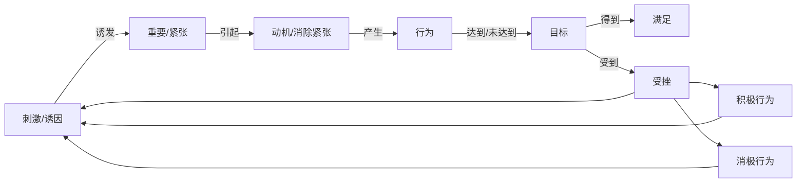
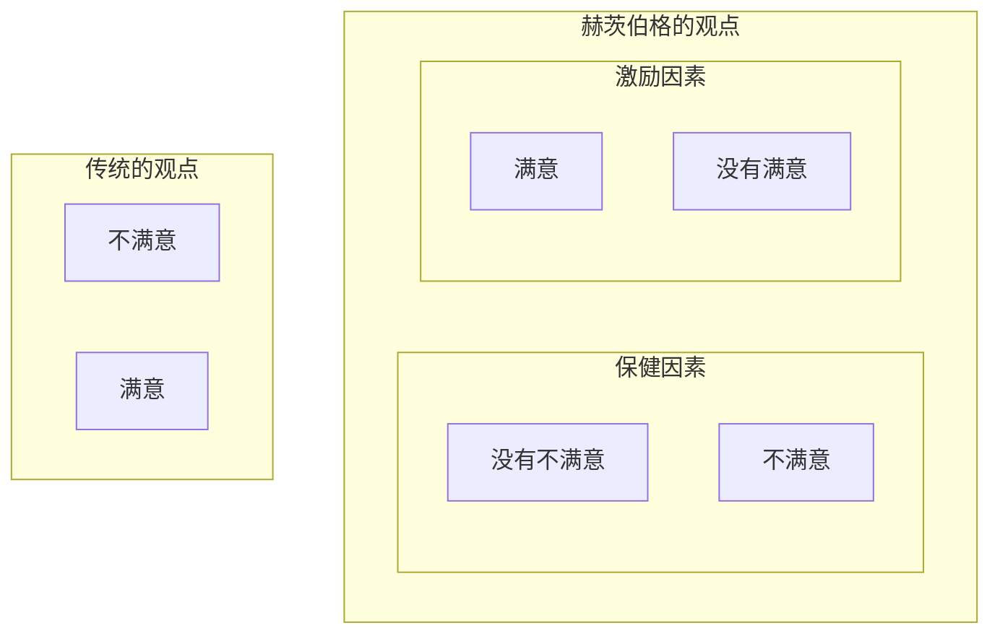

## 12.1 激励的基本概念

**定义**：通过创设条件满足人的需要，激发人的动机，将其内在潜力转化为实现目标的行为过程。

> 是一种强化作用、心理状态和持续反复的过程

### 12.1.1 人的行为过程及特点

**行为的界定**：

**定义**：**行为**是人类在环境影响下一切外在反应的统称。

**行为构成要素**：

- 行为主体
- 行为客体
- 行为环境
- 行为手段
- 行为结果

**分类**：

- 动机性行为
- 非动机性行为

**三大特征**：

- 目的性、方向性、预见性
- 与一定的客体相联系，作用于一定的对象，其结果与行为的动机、目的有一定的内在联系
- 会受到环境的影响，是人的内在因素和外在因素相互作用的函数

**动机性行为的过程**

**动机性行为的特点**：

- 自发性
- 目的性
- 持续性
- 可塑性
- 因果性

### 12.1.2 激励的作用

- 通过激励来挖掘人的潜力
- 通过激励可以为组织吸引优秀的人才
- 通过激励可以激发员工的创造性

**激励机理**：激励措施的生效的关键在于甄别出不同的人在不同的时间、不同的境遇下的优势需要并加以刺激。

#### 人性假设

**X 理论：把人的行为视为机器，需要外力作用才能产生**

- 员工天生不喜欢工作
- 大多数员工喜欢安逸

**Y 理论：把人视为一个有机的系统，不受外力影响，也受内力影响**

- 员工视工作如休息娱乐一般自然
- 员工会进行自我指导和控制
- 员工会主动寻求承担责任
- 绝大数人都有正确决策的能力

**超 Y 理论**：人们带着许多不同的需要和动机加入组织，但最主要的是实现其责任感。对不同的人实施不同的管理方式。

**超 Y 理论的特点**：

- 主体需求的差异性
- 组织方式相异性
- 控制程度应变性
- 目标确立递进性

**人性假设及其发展**：

- 经济人假设（X 理论 麦格雷戈）
  - 人是**自利**的，且**不是孤立的**
  - 人总是追求自身利益最大化，并且唯一目的是追求**私人的利益**
  - 人追逐利益的手段和内容会变化，但**自利的本性不变**
- 社会人假设
  - **基本观点**：人不仅具有经济性的需求，更具有社会性的需求，因此人与人之间的关系和组织的归属感比经济报酬更能激励人的行为。
  - 劳动者是由社会需求而引起工作的动机，并且通过与同事的关系而获得认同感。
  - 劳动者只能从工作上的社会关系寻求工作的意义。
  - 劳动者对同事们的社会影响力，比对管理者所给予的经济诱因控制更为重视。
  - 劳动者的工作效率随着上司能满足他们社会需求的程度而改变。

## 12.2 激励理论

**类型**：

- **行为基础理论**：
  - 重点：人的需要
  - 内容：需要层次理论、双因素理论、成就需要理论
- **过程激励理论**：
  - 重点：行为的发生机制
  - 内容：公平理论、期望理论、目标设置理论
- **行为强化理论**：
  - 重点：对行为的修正和固化
  - 内容：强化理论

### ▲12.2.1 行为基础理论

#### 需要层次理论——亚伯拉罕·马斯洛

**基本观点**：

- 人类需要从低到高**可以分为五种**
- 通过外部条件就可以满足：**生理需要、安全需要、社交需要**；通过内部因素：**尊重需要和自我实现需要**（高层次）
- 人的需要有一个从低层次向高层次发展的过程
- 任何一种需要并不由于高层次需要的出现而消失
- **未满足的需要才具有激励作用**

> 需求层次理论中人的需求不能越级发展，必须一步一步的上跃，当某个级别被满足之后就会失去激励的作用，从而上升为更高层级的。
>
> 而且因为每个层级的需求都很多，**不要求把所有的需求都满足**了才可以上升，**部分满足**就可以。

**积极方面**：

- 抓住了激励问题的关键
- 符合人类需要发展的一般规律

**局限性**：

- 缺乏普遍性
- 人的需要既有先天的，也有后天的
- 带有明显的机械论

> **ERG**理论（克雷顿·奥尔德弗）：基于需要层次理论的人本主义需要理论。人们共存在的 3 种核心的需要：**生存(Existence)的需要、相互关系(Relatedness)的需要和成长发展(Growth)的需要**

**两种理论不同处**：

- ERG 理论表明：人在同一时间可能有不止一种需要起作用；如果较高层次需要的满足受到抑制的话，那么人们对较低层次的需要的渴望会变得更加强烈
- ERG 理论**受挫——回归**思想：马斯洛认为一个人某一层次需要尚未得到满足时，会停留在此阶段；而 ERG 理论认为，当一个人在某一更高等级的需要层次受挫时，作为替代，他的某一较低层次的需要可能会增加

#### 双因素理论——赫茨伯格

**基本观点**：

- **保健因素**：使人们感到不满意的因素往往是属于工作环境或外界因素方面的（无激励作用）
- **激励因素**：使人们感到满意的因素往往都是属于工作本身或工作内容方面的
- **保健因素只能消除不满意，激励因素才是调动人们积极性的关键**

**积极性**：

- 修正了传统的满意与不满意的观点

**局限性**：

- 缺乏普遍性
- 实际上满意和工作绩效无直接相关性
- 实际上保健因素和激励因素不是绝对的，而是相互联系并可以相互转化的

> 与马斯洛理论的比较：
>
> 马斯洛理论中的**生理需要、安全需要、社交需要**是**保健因素**，**尊重需要和自我实现需要**是**激励因素**。

#### 成就需要理论——戴维·麦克利兰

**基本观点**：

- 又称**三种需要理论**
- 人的许多需要不是生理性的而是社会性的，社会性需求是后天的，环境等因素不同，人的需求就不同，自我实现的标准也不同

**三种需要**：

- **成就需要**：争取成功、希望做得最好的需要
- **权力需要**：影响或控制他人且不受他人控制的需要，**这是管理成功的基本要素**
- **亲和需要（归属需求）**：建立友好亲密的人际关系的需要

**高成就需求者的特点**：追求卓越、与众不同；希望立即得到具体的信息反馈，了解工作的结果。感兴趣的是他们个人如何做好，而不是如何影响其他人做好。

**高权力需要**表现为左右别人以某种方式行为而不以其他方式行为的需要。

**权力动机**：是一种控制他人或感觉优越于他人的一种需求，是感觉自己处于负责地位的一种需求。

**归属动机**：即社会交往动机。

> 一个优秀的管理者，往往权力需要比较高，成就需要低于权力需要，亲和需要相对最低。

### 12.2.2 过程激励理论（了解）

#### 公平理论——约翰·亚当斯

**基本观点**：

- 人们对报酬是否满意是一个社会比较过程，满意的程度不仅取决于绝对报酬，更取决于**相对报酬**

  > $$相对报酬=\frac{O}{I}=\frac{报酬(工资、奖金、津贴、晋升、表扬等)}{贡献(知识、经验、技能、资历、努力等)}$$

- 人们对相对报酬的比较体现在**横向比较和纵向比较**两个方面

  - 横向比较：将自己的相对报酬和他人的相对报酬进行比较

    > $$\frac{OP}{IP} VS \frac{OC}{IC}$$
    >
    > OP——对自己所获报酬的感觉
    >
    > IP——对自己所做投入的感觉
    >
    > OC——对他人所获报酬的感觉
    >
    > IC——对他人所做投入的感觉

  - 纵向比较：将自己当前的相对报酬与自己过去的相对报酬进行比较

    > $$\frac{OP}{IP} VS \frac{OH}{IH}$$
    >
    > OH——对自己过去报酬的感觉
    >
    > IH——对自己过去投入的感觉

  - 情况|行为
    :-:|:-:
    $\frac{OP}{IP} < \frac{OC}{IC}$|通过**减少投入或增加报酬**改变自己的相对报酬或**让他人多付出或减少报酬**来改变他人的报酬
    $\frac{OP}{IP} > \frac{OC}{IC}$|通过**增加投入**来改变自己的相对报酬或**增加他人报酬**来改变其相对报酬
    $\frac{OP}{IP} < \frac{OH}{IH}$|通过**减少投入**来改变自己的相对报酬
    $\frac{OP}{IP} > \frac{OH}{IH}$|**不会因为自己多拿了报酬而主动增加投入**
  
- **公平感**是一种主观心理感受，是人们公平需要得到满足的一种直接心理体验。

  - 制约公平感的因素：
  - 分配政策是否公平以及执行过程是否公平，即**客观是否公平**
  - 当事人的公平标准，即**主观感受是否公平**

**贡献**：

- 提出了**相对报酬**的概念

**启示**：

- 利用公平感来调动员工的积极性，强调管理者必须遵循公正原则

**局限性**：

- 不完全信息往往使社会比较脱离客观实际；主观评价易使社会比较失去客观标准

#### 期望理论——维克托·弗鲁姆

**基本观点**：

- 人们在预期他们的行动会给人带来既定的成果且该成果对个人具有吸引力时，才会被激励起来去做某些事情以达到组织设置的目标。

  > **$$ M=V × E$$**
  >
  > $M: motivation$
  >
  > $V: value$
  >
  > $E: expectancy$
  >
  > 1. $M(low)=V(low)\times E(low)$
  > 2. $M(low)=V(low)\times E(high)$
  > 3. $M(low)=V(high)\times E(low)$
  > 4. $M(high)=V(high)\times E(high)$

**激励的过程要处理好三方面的关系**：

- 努力与绩效的关系
- 绩效与奖励的关系
- 奖励与满足需要的关系

#### 目标设置理论——爱德温·洛克

**基本观点**：

- **目标本身就具有激励作用**，目标能把人德需转变为动机，使人们的行为朝着一定的方向努力，并将自己的行为结果与既定的目标相对照，及时进行调整和修正，从而实现目标

**目标对人们努力程度的影响取决于四个方面**：

- **目标明确性**：具体的目标要优于空泛的目标
- **目标难易性**：有一定难度的目标比唾手可得的目标要好
- **目标责任清晰度**：责任清晰的目标比责任不明的目标好
- **目标接受度**：人们接受的目标将提高其实现过程中的自觉性与主动性

**要求**：

- 要有一定难度，也要在能力范围之内
- 明确具体
- 必须全力以赴，努力达成目标
- 短期或中期目标要比长期目标可能更有效
- 要有定期反馈
- 应当对目标达成给予奖励

> 要达到激励的效果，需要满足两个内容：
>
> - 完成任务的期望概率是合理的
> - 完成任务得到的价值合理的

### 12.2.3 行为强化理论（了解)

#### 行为强化理论——斯金纳

**基本观点**：

- 人们出于某种动机，会采取一定的行为作用于环境；当这种行为的后果对人们有利时，这种行为就会在以后重复出现；反之，当这种行为的结果对人们不利时，这种行为就会减少或消失。

**强化**：在本质上讲是对某一行为的肯定或否认的结果，其在一定程度上会决定该行为在今后是否重复发生。（最早的强化概念由巴普洛夫提出）

**强化的分类**：

- 依据强化的目的：
  时机/行为、对象|令人愉快或希望的事件|令人不快或不希望的事件
  :-:|:-:|:-:
  事件的出现|正强化（行为变得更加可能发生）|惩罚（行为变得更不可能发生）
  事件的取消|自然消退（行为变得不可能发生）|负强化（行为变得更加可能发生）

- 依据强化的方式：
  
  - 连续强化：对每个行为都给予强化
  - 间断强化：固定比率、可变比率、固定时间间隔、可变时间间隔

**应用强化的原则**：

- 要按照强化对象的不同需要采取不同的强化措施
- 对所期望取得的工作业绩应予以明确的规定和表述
- 对工作业绩予以及时的反馈

**局限**：

- 过分强调对人的行为的限制和控制，而忽视了人的内在心理过程的状态；忽略人的因素和主观能动性对环境的反作用

### 12.2.4 综合激励模型（了解）

由美国行为科学家**爱德华·劳勒和莱曼·波特**提出的一种激励理论。

**内容**：

- 一个人做出成绩后，得到两类报酬：外在报酬（低层次的需要）和内在报酬（高层次的需要）
- 在其间必然要经过**所理解的公正报酬**来调节，即**一个人要把自己所得到的报酬同自己认为应该得到的报酬相比较（和公平理论有点像）

### 12.2.5 激励理论综述（了解）

人的行为基本上包括三个环节：确认个人有什么需要，寻找满足需要的目标；个人认同目标，需要变成动机，推动行为；达到目标满足需要

激励理论可以根据它们研究的人的行为过程的不同环节，做出归类：

- **内容型积极理论**：管理者应如何通过给人们提供满足各种需要的诱因，引发接受和完成组织任务的行为动机，是这类理论的任务

  主要包括：马斯洛的需要层次理论、双因素理论、ERG、成就需要理论

- **过程型激励理论**：研究如何使个人选择管理者设置的诱因，将其认同为自己的行为目标，并且使这个行为保持下去的理论

  主要包括：期望理论和公平理论

- **行为改造型激励理论**：研究人的行为结果的反馈对下一次行为动机的影响

  主要包括：强化理论、归因理论和挫折理论

> **挫折理论**（亚当斯）：由于目标无法实现，动机和需要不能满足，就会导致产生一种情绪，这就是**挫折**
>
> **使人产生挫折心理的三个必备条件**：
>
> 1. 个人所得期望的目标是重要的、强烈的
> 2. 个人认为这种目标有可能达成
> 3. 在目标与现实中存在难以克服的障碍
>
> **引起挫折的原因既有主观的、也有客观的**：主观原因主要是个人因素，客观原因主要是社会因素
>
> 根据不同人的心理特点，受到挫折后的行为表现主要有两大类：
>
> - 采取积极进取态度
> - 采取消极态度
>
> 在管理活动中：
>
> - 培养员工掌握正确战胜挫折的方法
> - 正确对待受挫折的员工
> - 积极改变情境