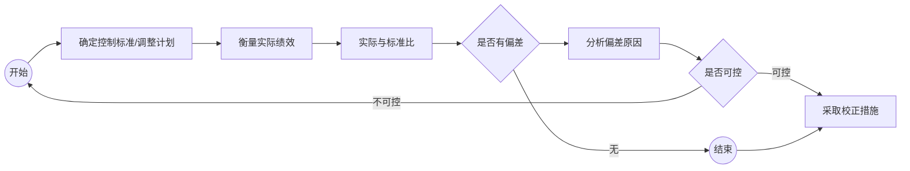

## 14.1 控制基本概念

### 14.1.1 控制的基本概念

**控制**是指对组织内部的管理活动及其效果进行衡量和矫正，以确保组织的目标以及为此而拟定的计划得以实现。

**特点**：

- **目的性**
- **整体性**
- **通过监督和纠偏来实现**
- **是一个过程**

**控制的系统**：控制的系统由**控制主体、控制客体、控制目标以及控制的手段与工具体系**四大部分构成。

- **控制主体**：分为高层控制主体、中层控制主体、底层控制主体
- **控制客体**：就是评价的对象范围。具体控制对象就是控制的最终指向物，包括财产、交易和信息三大类
- **控制目标**：
  - 确保组织目标的有效实现
  - 经济且有效地利用组织资源
  - 确保信息的质量
- **控制的手段与工具体系**
  - 机构由组织中不同的控制层次和不同性质的专业控制部门组成
  - 工具主要是凭以获取信息的计算机和网络等
  - 控制的运作制度是指控制的任务与职责、控制的程序与规则等

**现代控制产生的原因**：

- 组织环境的不确定性
- 组织活动的复杂性
- 管理失误的不可避免

**控制和计划的关系**：

- 计划起着指导性作用，为控制提供标准，控制则是为了保证组织的产出与计划一致而产生的一种管理职能
- 计划预先指出了所期望的行为和结果，而控制则是按计划指导实施的行为和结果
- 只有管理者拥有整个组织、各部门的相关信息后才能制定出有效的计划，而这些信息中的绝大多数是通过控制过程得到的

### 14.1.2 控制类型

- **控制进程分类**
  - **前馈控制**（预先控制）：面向未来
  - **现场控制**（同步控制或同期控制）：面对面的领导，有监督和指导两项职能
  - **反馈控制**（事后控制）：防止之后再度发生
- **控制职能分类**
  - **战略控制**：对战略的实施情况进行全面评价、发现偏差、进行纠正
  - **财务控制**：比率分析和预算分析，还使用经济附加值和市场附加值
  - **营销控制**：主要包括年度计划控制、盈利控制、效率控制和战略控制
- **控制内容分类**
  - 制度控制
  - 风险防范控制
  - 预算控制
  - 激励控制
  - 绩效控制

### 14.1.3 有效控制

**控制原则**：

- **反映计划要求原则**：控制的目的是为了实现计划
- **控制关键点原则**：关注具有关键意义的因素
- **控制趋势原则**：现状所预示的趋势更重要
- **例外性原则**：只注意一些重要的例外偏差（特别好或特别坏的情况）

**控制中的阻力**：

- 过分的控制
- 不恰当的控制点
- 不公平的报酬
- 责任制度问题

**减少阻力的方法**：

- 建立有效的控制系统
- 让尽可能多的人参与控制
- 采用目标管理
- 建立记录备查制度

### 14.1.4 控制过程

**控制的基本过程**：

1. **确定标准**

   - 选择控制对象

   - **选择关键控制点**

     考虑如下因素：影响整个工作运行过程的重要操作与事项

     - 能在重大损失出现之前显示出差异的事项
     - 若干能反映组织主要绩效水平的时间与空间分布均衡的控制点

     > 良好的控制来源于关键控制点的正确选择，因而这种选择或决策的能力也就成为判断管理者控制工作水平的一个重要标准。

   - **确定控制标准**

     **方法**：

     - 统计计算法
     - 经验估计法
     - 工程方法

     **基本要求**：

     - 简明性
     - 适用性
     - 一致性
     - 可行性
     - 可操作性
     - 相对稳定性
     - 前瞻性

     **控制标准的类型**：

     - 定性标准：一般是有关服务质量、组织形象
     - 定量标准：便于度量和比较，如时间标准、生产率标准等

2. **衡量绩效**：制定控制标准是为了衡量实际业绩，取得控制对象的相关信息，把实际工作情况和标准进行比较，据此对实际工作做出评估。

   - 衡量的主体
   - 衡量的项目
   - 衡量的方法
   - 衡量的频度：有效控制要求确定适宜的衡量频度

3. **分析与纠偏**

   - **分析偏差：找到造成偏差的原因**

     - 计划指标/工作标准制定不科学
     - 外部环境中发生了意外变化
     - 组织内部因素的变化

   - **实施纠偏：采取纠偏行动**

     - 改善工作
     - 修订标准

     纠偏措施：

     - 应急纠偏措施：解决急性问题
     - 彻底纠偏措施：根本上解决问题

## 14.2 控制技术

### 14.2.1 控制技术

从**战略层次**的角度，组织的控制方法可以划分为三类：**层级控制、市场控制、团体控制**。

#### 层级控制

- 也称为官僚控制、科层控制，是指利用正式的章程、规则、政策、标准、科层权力、书面文件和其他科层机制来规范组织内部门和成员的行为并评估绩效。
- 是多数**中型和大型组织**最基本的控制方式
- 常见的层级控制方法有**预算控制、审计控制和财务控制**
- **预算控制**：根据预算规定的收入指出来检查和衡量，通过编制和执行预算来进行。
  - 局限性：
    - 只能控制可计量的业务活动
    - 编制预算时常参照上期项目和标准
    - 组织外部环境的不断变化
  - 所编制预算必须体现单位的经营管理目标，并明确责任
  - 预算在执行中，应当允许经过授权批准对预算进行调整，以便预算更加切合实际
  - 应当及时或定期反馈预算的执行情况
- **审计控制**：对反应组织资金运动过程及其结果的会计记录和财务报表进行审核、鉴定，判断真实性和公允性。审计是一项**较独立的经济监控活动**。
  - 分为外部审计（外部机构）和内部审计（组织内部机构）
- **财务控制**：对企业的资金投入及收益过程和结果进行衡量和校正，以确保企业目标以及为达到此目标所指定的财务计划得以实现。
  - 指标有：偿债能力比率，盈利能力比率，营运能力比率

#### 市场控制

- 是指组织借助经济的力量，通过价格机制来规范组织内部门和员工的行为。
- 动因：**企业内部组织管理成本过高**
- 原则：
  - 把组织建设称为由内部企业组成的机构
  - 用市场的机制代替直接的命令来管理组织
  - 在内部市场中鼓励集体的合作精神
- 层次：公司层、部门层（转移定价）、个人层（激励制度、工资制度）

#### 团体控制

- 是指将个人融入团体之中，将个人的价值观与组织的价值观和目标相统一，通过团体的共同行为范式来实现组织成员的自我约束和自我控制。
- 动因：主要来自于组织成员和工作性质的变化、控制环境的变化、雇佣关系的变化
- 团体控制的实施：基础是组织文化
  - 构建创新的组织文化
  - 创建响应顾客需求的文化
  - 创建良好的职场精神

### 14.2.2 质量控制

#### 质量控制方法

**工作质量与过程控制**

- 质量分为产品质量和工作质量
- 质量管理是指明确质量方针、目标和职责，并通过质量体系中的质量策划、质量控制、质量保证和质量改进来实现管理职能的全部活动
- 过程控制不仅对产品提供全过程的管理，而且包括各方面业务过程的协调
- 过程控制优化的基本方法是根据**价值原则**对业务流程体系进行系统化改造

**全面质量管理方法**

- 基本要求：**三全一多**，即**全过程**的质量管理、**全员**的质量管理、**全组织**的质量管理和**多方法**的质量管理
- 八个原则：
  - 以顾客为关注焦点
  - 领导作用
  - 全员参与
  - 过程方法
  - 管理的系统方法
  - 持续改进
  - 基于事实的决策方法
  - 与供方互利的关系
- 基本方法：**PDCA循环**