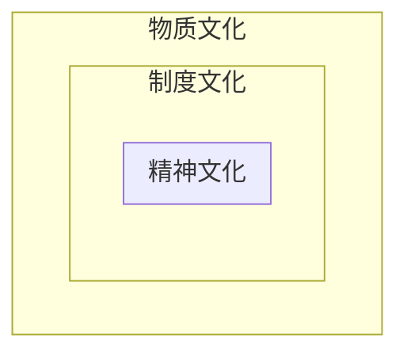

## 10.1 组织结构类型

### 10.1.1 组织与组织工作

**概念**：组织是指为了实现既定的目标，按一定规则和程序而设置的多层次岗位及其有相应人员隶属关系的权责角色结构。

**含义**：

- 组织有特定目标
- 组织有分工与协作
- 组织是一个利益共同体
- 组织有一系列职能活动

**分类**：

- 按照规模：小型、中型、大型
- 文化组织、经济组织、政治组织
- 按照根本目标：营利性、非营利性
- 正式组织、非正式组织

### 10.1.2 组织结构类型

**基本概念**：组织结构就是指组织要素间的联系，即组织中使工作任务分解、组织协调的框架体系。

**基本维度**：

- 复杂性：组织的分化程度：分工越细致层级越多
- 集权化：决策权力的集中程度
- 正规化：组织依靠规则和程序引导员工行为

**组织结构基本类型**：

- **直线制**

  - **优点**：结构比较简单，责任分明，命令统一
  - **缺点**：要求行政负责人通晓多种知识和技能，亲自处理各种业务。

  - 只适用于规模较小，生产技术比较简单的企业。
  - 在直线型组织结构下，**经营管理职能只存在垂直分工（职权范围大小）而不存在水平分工（采购、销售、财务、人事、安全等）**，是一种**集权式**的组织结构形式。

- **职能制**

  - 指行政组织同一层级**横向**划分为若干个部门，每个部门业务性质和基本职能相同，但互不统属，相互分工合作的组织体制。（专业化）
  - **优点**：适应现代化工业企业生产技术比较复杂，管理工作比较精细的特点；能充分发挥职能机构的专业管理作用，减轻直线领导人员的工作负担。
  - **缺点**：妨碍了必要的集中领导和统一指挥，形成了多头领导。不利于建立和健全各级行政负责人和职能科室的责任制，容易造成纪律松弛。
  - 主要适用于中小型的、产品品种比较单一、生产技术发展变化较慢、外部环境比较稳定的企业。

- **直线职能制**

  - **优点**：既保证了企业管理体系的集中统一，又可以在各级行政负责人的领导下，充分发挥各专业管理机构的作用。（**集中统一领导，专业化管理**）
  - **缺点**：职能部门之间的协作和配合性较差，加重上层领导工作负担，造成办事效率低。

- **事业部制（斯隆模型）**

  - 除了人事决策、预算控制和监督大权，均由事业部和所属工厂负责，实行单独核算，独立经营。
  - **优点**：总公司领导可以摆脱日常事务，集中精力考虑全局问题。事业部独立核算，增加积极性，促进内部协作；事业部互相竞争，促进企业发展；内部供产销易协调；利于培养和训练管理人才。
  - **缺点**：管理人员浪费；各事业部只考虑自身利益，影响协作；一些业务联系与沟通被经济关系替代。

- **模拟分权制**

  - 一种介于直线职能制和事业部制之间的结构形式。

- **矩阵制**

  - 为了改进直线职能制横向联系差，缺乏弹性的缺点而形成的一种组织形式。**特点是围绕某项专门任务成立跨职能部门的专门机构**。
  - **优点**：机动、灵活
  - **缺点**：项目负责人的责任大于权利，因为是临时成立的部门，容易产生临时观念。
  - 适用于一些重大攻关项目，特别适用于开发与实验为主的单位。

- **多维立体**（多维组织）

  - 由美国道-科宁化学工业公司创立，包括三类管理机构：
    - 按产品划分的事业部：产品利润中心
    - 按职能划分的专业参谋机构：专业成本中心
    - 按地区划分的管理机构：地区利润中心
  - **优点**：互报情报、集思广益、统筹全局、共同决策
  - **缺点**：相互协调难、管理成本高、决策速度慢
  - 适用于从事大规模生产经营而又需要保持灵活反映的跨国公司或大型跨地区公司。

- **委员会制**

  - 集体管理，由委员会成员集体决策。
  - **优点**：集体领导、集思广益。委员会代表是各领域代表，决策专业。
  - **缺点**：少数有影响力的人不能反映集体的决策；为了得到全体委员的一致结论，往往形成妥协与折中的结果，实际上是大家都不负责。

- 虚拟组织

  - 组织成员以现代通讯技术、信息存储技术、机器智能产品为依托，通过高度自律和高度的价值取向共同实现团队共同目标。
  - 动态联盟，开放式的组织结构。

- 无边界组织

  - 边界不由某种预先设定的结构所限定或定义。

### 10.1.3 未来的发展趋势

- 扁平化——减少管理层级，增加管理幅度
  - 优点：
    - 便于高层管理者了解各科层组织的运行情况
    - 减少管理人员、成本、降低协调难度
    - 信息传递速度加快，减少信息的过滤和失真
    - 利于调用成员积极性，提高决策的民主化程度
  - 缺点：
    - 加重了管理人员的工作负荷
    - 相同层级的沟通会产生新的困难
    - 对管理人员的素质要求较高
    - 要求下属人员自立、自律，否则容易失去控制，且下属缺少提升机会
- 柔性化——通过设置协调岗位**加强组织内部的横向联系**，增强组织机动性的一种趋势。
  - 方式：充分发挥非正式组织的作用，加强横向沟通
- 虚拟化——形成以网络为载体的生态系统

**锥形（宝塔式）**：

- 锥形与扁平形的组织形式相反。

- 结构——管理幅度小，管理层次多。
- 优点：管理严密、分工明确、上下级易于协调
- 缺点：管理人员多、层级增加导致沟通问题、上层管理者对下层的控制被削弱、管理过于严密影响下级人员的主动性与创造性。

 ## 10.2 组织结构设计

### 10.2.1 组织设计的任务与影响因素

**任务**：设计清晰的组织结构，规划各部门的职能和权限

**内容**：

- 静态

  - 职能设计
  - 部门设计
  - 层级设计

- 动态

  - 沟通系统设计
  - 管理规范设计
  - 激励设计

  

**影响因素**：

- 环境：一般环境和任务环境
  - 环境复杂性 `=>` 组织部门和岗位设置
  - 环境不确定性 `=>` 组织结构
- 战略：组织结构与战略相适应
- 技术
- 规模
  - 规范程度
  - 集权程度
  - 复杂程度
  - 人员结构
- 发展阶段：组织生命周期（生成期、成长期、成熟期、衰退期、再生期）

**原则**：

- 目标一致原则
- 分工与协作原则
- 有效管理幅度原则
- 权责对等原则
- 柔性经济原则

### 10.2.2 组织结构设计

**职能设计**：调整企业内不合理的职能

- **职能分析**
  - 从内容、性质、相互关系和分工等多方面
  - 确定**基本职能、关键职能、特殊职能**
- **职能调整**
  - 分析现有问题，提出改进
- **职能分解**
  - **将企业的每一个职能细分为可以操作的各项具体的管理业务活动，即为职能分解。通过职能分解，企业的全部职能才能转换为管理人员的具体工作内容，最终得以落实。**
  - 职能可以分为三级：一级=>二级=>三级（业务活动）

> 管理中的组织职能设计就是在管理劳动分工的基础上，设计出组织所需的管理职务及其之间的关系。(✔)

**组织层级设计**

- **管理跨度（管理宽度或管理幅度）**：指一名主管人员有效地监督、管理其直接下属的人数
  - 随着管理宽度增加，主管人员与下属间可能存在的相互交往的人际关系数**几乎以几何级数增加**
- **管理层次（管理级别）**：最高级到最低级的各个组织等级。
  - 按照提高组织效率的要求，确定具体的管理层次
  - 按照组织的不同部分的特点，对管理层次做局部调整
- 组织规模一定，管理幅度越大，层级越少（反比例）

> 管理层次受到组织规模和管理幅度的影响。它与组织规模成正比，在组织规模已定的条件下，它与管理幅度成反比。(✔)

**集权与分权**

- **影响分权的因素**：
  - 组织规模
  - 政策的统一性
  - 成员自我管理能力
  - 组织的可控性
  - 组织的发展阶段

**授权**

- 内容：工作任务安排，权力转移，明确责任
- 原则：目的性原则、权责一致原则、信任原则

**职权**

- 分为直线职权、参谋职权、职能职权

- 直线与参谋的关系：

  - 直线管理人员：位于组织纵向层级中特定职位的管理者，拥有直线职权

  - 参谋人员：从专业的角度为特定层级的管理者提供咨询、建议的管理者

  - 相同点：

    - 都是组织的管理者，共同为组织目标服务
    - 参谋为直线管理者提供咨询、建议和审查方面的专业服务
    - 都是为了克服管理人员的局限性而设置的。直线部门——管理幅度的限制；参谋——弥补直线管理人员专业知识和精力方面的局限性。
    - 直线和参谋的角色可以转换

  - 不同点：
  	 -|直线管理者|参谋人员
  	 :-:|:-:|:-:
  	 职权性质不同|拥有直线职权|拥有参谋职权，依附于某一个直线部门
  	 设置方式不同|按组织层级自上而下逐级设置|按照专业需求设置
  	 在决策中的角色不同|与其岗位相适应的决策权|建议权
  	 考核标准和待遇不同|取决于所在组织层级、岗位和绩效|由所提供的而建议、服务的价值决定
  	 所承担的责任不同|做出决策并对决策的结果负责|不承担决策结果的责任
  

## 10.3 组织文化

### 10.3.1 组织文化概述

企业文化这个名词孕育于日本，成熟于美国。对其的研究分为三阶段：企业综合管理研究，美日两国管理的比较研究，深入改革的研究。

#### 组织文化的兴起

- 逐渐从过分相信科学的理性模式转变为关注人的主观能动性
- 全球化的需要
- 忽视了人的情感因素
- 日本特色文化管理的影响

> 组织文化的理论诞生于美国，而在日本企业管理实践中得到最大的体现。

#### 组织文化的含义

组织文化指的是一个组织在长期实践活动中形成的具有本组织特征的文化现象，是组织中的全体成员共同接受和共同遵循的价值观念、思维方式、心理预期、行为准则、团队归属感以及工作作风等群体意识的总称。

#### 组织文化的分类

- 按组织文化的**内在特征**分类——杰弗里·桑南菲尔德
  - **学院型组织文化**：喜欢雇佣年轻大学生
  - **俱乐部型组织文化**：非常重视适应、忠诚和承诺
  - **棒球队型组织文化**：鼓励冒险、革新和发明创造
  - **堡垒型组织文化**：着眼于企业生存，喜欢流动性和挑战性
- 按组织文化**对组织成员的影响力**分类——约翰·科特、詹姆斯·赫斯科特
  - **强力型组织文化**：提供必要的组织机构和管理机制，组织成员方向明确、步调一致，有共同的价值观念和行为方式，愿意为组织工作或献身
  - **策略合理型组织文化**：只有当组织文化适应于组织环境时，这种文化才有效
  - **灵活适应型组织文化**：提倡信心和信赖感、不畏风险、注重行为方式等，组织成员之间相互支持，用于发现问题、解决问题
- 按组织文化**所覆盖的范围**分类
  - 主文化
  - 亚文化
- 按**权力的集中度**分类——赖特和科伯
  - **权利型组织文化**（集权，以人为中心）：不太看重组织中的正式结构和工作程序
  - **作用型组织文化**（集权，以职能为中心）：内部有健全的正式规则、规章制度和工作程序、等级制度严格；不是一种有效的组织变革文化
  - **使命型组织文化**（分权，以任务为中心）：没有领导者，唯一需要服从的就是任务或者使命本身，成员之间地位平等；容易产生恶行的“政治紊乱”
  - **个性型组织文化**（分权，以人为中心）：既以人为导向、又强调平等的文化；富有创造性、孕育新观点，允许每个人按照自己的兴趣工作，同时保持相互有利的关系
- 按**文化、战略与环境的配置**分类：
  - **适应型组织文化**：战略重点放在外部环境上
  - **使命型组织文化**
  - **小团体型组织文化**
  - **官僚制型组织文化**

#### 组织文化特征

- 精神性
- 相对稳定性
- 融合性

1. 系统性：由共享价值观、团队精神、行为规范等一系列内容构成一个系统，各要素之间相互依存、相互联系
2. 继承性：有其特定的文化背景，受到国家或者民族间的文化、价值观影响
3. 可塑性：不是与生俱来的，而是通过组织生存和发展过程中逐渐总结、培育和积累而形成的
4. 长期性：组织文化的塑造和重塑的过程需要相当长的时间，而且极其复杂

> 组织文化的模式一经确定就不会轻易变化。(❌)

#### 影响因素

- 外部因素
  - 民族文化
  - 制度文化
  - 外来文化
- 内部因素
  - 领导者素质
  - 组织成员的素质
  - 组织发展的不同阶段

### 10.3.2 组织文化构成与功能

**三个层次之间的关系**：

- 物质文化层和制度文化层是精神文化层的体现，也叫**表层**
- 制度文化层是精神文化层与物质文化层的中介
- 精神文化层决定了制度文化层和物质文化层，也是**核心层**

#### 物质层

是组织文化的表层部分，是一种以物质形态为主要研究对象的表层组织文化，是形成组织文化精神层和制度层的条件。

#### 制度层

是组织文化的中间层次，把组织物质文化和组织精神文化有机地结合称一个整体。**集中体现了组织文化的物质层和精神层对成员和组织行为的要求**。规定了组织成员在共同的生产经营活动中应当遵守的行为准则。

#### 精神层

即组织文化，**反映全体员工的共同追求和共同认识。组织精神文化是组织价值观的核心和灵魂，是组织优良传统的结晶，是维系组织生存发展的精神支柱**。主要包括：价值观、道德规范、组织精神等。

#### 组织文化的正功能

- **导向功能**

  以一种适应性文化引导着组织整体和每一个成员的价值取向和行为取向，使之符合组织确定的目标。

- **约束功能**

- **凝聚功能**

  以各种微妙的方式沟通组织成员的思想感情，融合人们的理想、信念和情操，培养和激发群体意识

- **激励功能**

- **辐射功能**

  对组织成员和社会都会有影响

- **调适功能**

  使新加入组织的成员尽快适应组织

- **创新功能**

#### 组织文化的负功能

- 变革的障碍：组织文化根深蒂固，难以变革
- 多样化的障碍：遏制新成员价值观
- 兼并和收购的障碍：组织文化不同难以整合

### 10.3.3 组织文化的设计与塑造

#### 组织文化建设的关键步骤

- 组织文化现状的调查和分析
- 核心文化的提炼与定位
- 组织文化的外层建设
- 形象识别系统设计(CIS)
  - 企业的理念识别——MI
  - 行为识别——BI
  - 视觉识别——VI
- 组织文化的贯彻与渗透

#### 组织文化塑造

**概念**：是指组织有意识地发扬其积极、优良的文化，摒弃其消极、劣性的文化的过程

**主要动机**：**通过确立组织宗旨和组织精神，构筑组织文化的灵魂**。通过确定组织文化的导向，利用组织共同的价值取向引导组织成员的行为，使之更好地符合组织与社会的要求。

**如何选择正确的价值观**：

- 组织价值观要体现组织的宗旨和发展战略与方向
- 组织价值观要与组织文化各要素之间相互协调
- 组织价值观要得到组织成员和社会的认可与接受

**强化组织价值观和组织文化模式的方法**：

- 广泛宣传
- 培养和树立典型
- 加强培训和教育

**走向成熟**：

- 精心分析
- 全面归纳
- 精炼定格
- 建立规章制度
- 领导者率先垂范