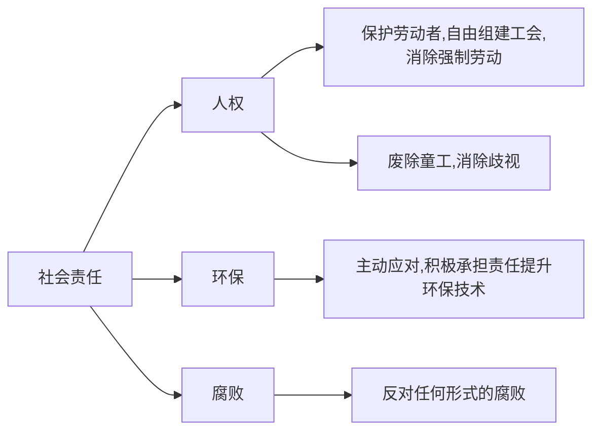

## 4.1 社会责任
### 4.1.1 早期思想
**企业社会责任思想**：
  - 起点：亚当·斯密——“看不见的手”
  - 理论：古典经济学理论认为，一个社会通过市场能够最好地确定其需要，**如果企业尽可能高效率地使用资源以提供社会需要的产品和服务，并以消费者愿意支付的价格销售它们，企业就尽到了自己的社会责任。**

**历史阶段**：
  1. 工业革命后企业单纯追逐利益
  2. 19 世纪中后期开始出现了相关的约束法案
  3. 20 世纪 50-70 年代开始有学者系统研究
  4. 20 世纪 80 年后，企业社会责任开始受到企业和学者的关注
  5. 21 世纪初中国开始关注企业社会责任

历史阶段|阶段 1-工业化初期|阶段 2-工业化中期|阶段 3-工业化后期|阶段 4-后工业化时期
:-:|:-:|:-:|:-:|:-:
企业目标|股东利润最大化|企业利润最大化兼顾员工利益|追求企业相关利益者价值最大化|追求企业相关利益者价值最大化同时要保护和增进社会福利
社会责任|更小←|—|—|→更大

### 4.1.2 概述

**本书关于社会责任的定义**：社会责任是企业在遵守有关法律、法规和追求经济利益的前提下，还必须承担起**追求对社会有益的长期目标**的义务，要对**整个社会的政治、经济发展负责**。

**社会义务**是企业参与社会的**基础**；
**社会责任**与**社会反应**超出了基本的经济和法律标准。

### 4.1.3 两种社会责任观

1. **古典观**
2. **社会经济观**  **√**

&ensp;|古典观|社会经济观
:-:|:-:|:-:
利润|社会活动消耗企业资源|企业参与社会活动增加长期利润
股东利益|不符合股东利益|符合股东利益
权力|加强企业权力|企业权力有限
责任|非企业家责任|企业应当承担相应的社会责任
社会基础|缺乏社会基础|舆论对企业追求社会目标呼声高
资源|企业不具备|企业拥有承担社会责任所需资源

### 4.1.4 社会责任的具体表现
#### （一）对环境
- 企业要在保护环境方面发挥主导作用，推动环保技术
- 企业要以“绿色产品”为主要研发对象
- 企业要治理环境

#### （二）对员工
- 不歧视员工
- 定期或不定期培训员工
- 营造一个良好的工作环境
- 善待员工

#### （三）对顾客
- 提供安全的产品
- 提供正确的产品信息
- 提供售后服务
- 提供必要的指导
- 赋予顾客自主选择权利

#### （四）对竞争对手
- 企业不能压制竞争，也不能搞恶意竞争

#### （五）对投资者
- 为投资者带来回报

#### （六）对所在地区
- 多参与当地社会活动，树立良好的企业形象

### 4.1.5 医药企业的社会责任
- 规范药品生产流通秩序
- 企业自主创新能力
- 保证国家基本药物的可及性
- 建立诚信经营

## 4.2 管理道德

### 4.2.1 概念
- **管理道德**
特殊的职业道德，管理者行为准则和规范的综合，建立在一般道德准则之上，通过规范管理者的行为去实现调整管理关系的目的，从而提高管理效益
- **管理道德规范**
  - 忠于职守
  - 遵纪守法
  - 实事求是
  - 团结协作
  - 尊重人才

### 4.2.2 三种不同的道德观
1. **道德的功利观（结果主义）**
功利主义的目标是为尽可能多的人提供尽可能多的利益（关注**大多数人**的利益）
典型例子：**功利主义**，（英国）边沁提出
2. **道德的权力观（绝对主义）**
决策要在尊重和保护个人基本权利的前提下作出（关注**所有人**的利益）
3. **公平理论道德观**
要求管理者公平地实施规则

### 4.2.3 影响道德的因素

> mermaid 作图局限性太大，后期完善

#### 道德发展阶段
1. 前惯例期（并没有道德观念，凡事只会着重**个人利益**和只为满足自己而行事）
	- 阶段 1 避罚服从取向：只单纯为了免受惩罚而服于规范
	- 阶段 2 相对功利取向：为得到赞赏（取得利益）
2. 惯例期（道德观念是以**他人**的标准作判断，并以此为方向，尊重法律，对重要人物期望做出反应）
	- 阶段 3 寻求认可取向
	- 阶段 4 遵守法规取向：认为法律至高无尚，服从道德规范
3. 后惯例期（道德观念**超越**一般人和社会规范，有自我要求，受个人道德准则规范）
	- 阶段 5 社会法制取向：相信法律是为了维护社会大众的最大利益，一切会以大众的利益，仍有不足，有时会为了大众利益违法
	- 阶段 6 普遍伦理取向：凭自我心行事，认为有些法律有违其建立的原意

- **多数成年人的道德发展处于第 4 阶段**；
- **道德发展可能中断，可能停留在任何一个阶段**；
- **人们一步一步地依次通过这些阶段，而不能跨越**。

#### 个人特征
- 自我强度：度量一个人的**信念强度**。自我强度越高，克制冲动并遵守其心信念的可能性越大。
- 控制中心：度量**主宰自己命运**的程度，分**内在控制**和**外在控制**。

#### 结构变量
- 组织的结构设计有助于管理者道德行为的约束，有些提供有力指导，有些约束范围模糊。
- 例：
  - 上级行为
  - 合理的绩效评估体系
  - 报酬的分配方式
  - 赏罚标准的公平性

#### 组织文化

### 4.2.3 管理道德强度的决定因素

1. 对受害者伤害多大/对受益者利益有多大
2. 多少人认为此行为邪恶
3. 行为实际发生并造成实际伤害（利益）的可能性多大
4. 在行为和其预期后果之间的时间间隔有多长
5. 行为的受害者（受益者）与你在社会上/心理上/身体上有多近
6. 道德行为对有关人员的影响的集中程度如何